# ccanalytics C4 Architecture Documentation

> Comprehensive C4 model covering Context, Container, and Component levels for the
> ccanalytics local-first Claude Code analytics engine.
>
> Source: [00-v0-analysis.md](00-v0-analysis.md), [ccanalytics-V0.md](../ccanalytics-V0.md)
> Created: 2026-02-23

---

## Table of Contents

1. [C4 Context Diagram (Level 1)](#1-c4-context-diagram-level-1)
2. [C4 Container Diagram (Level 2)](#2-c4-container-diagram-level-2)
3. [C4 Component Diagrams (Level 3)](#3-c4-component-diagrams-level-3)
   - [Ingestion Engine Components](#31-ingestion-engine-components)
   - [Query Engine Components](#32-query-engine-components)
   - [CLI Shell Components](#33-cli-shell-components)
   - [Watcher Components](#34-watcher-components)
   - [Hooks Processor Components](#35-hooks-processor-components)
   - [Dashboard Renderer Components](#36-dashboard-renderer-components)
   - [Configuration Manager Components](#37-configuration-manager-components)
4. [Data Flow Diagram](#4-data-flow-diagram)
5. [Architecture Decision Records (ADR) Summary](#5-architecture-decision-records-adr-summary)
6. [Technology Stack Overview](#6-technology-stack-overview)

---

## 1. C4 Context Diagram (Level 1)

The Context diagram shows ccanalytics as a system boundary and its relationships with
external actors and systems. ccanalytics is a local-first CLI tool that ingests Claude
Code session data from the local filesystem, stores it in DuckDB, and presents analytics
through a terminal interface.

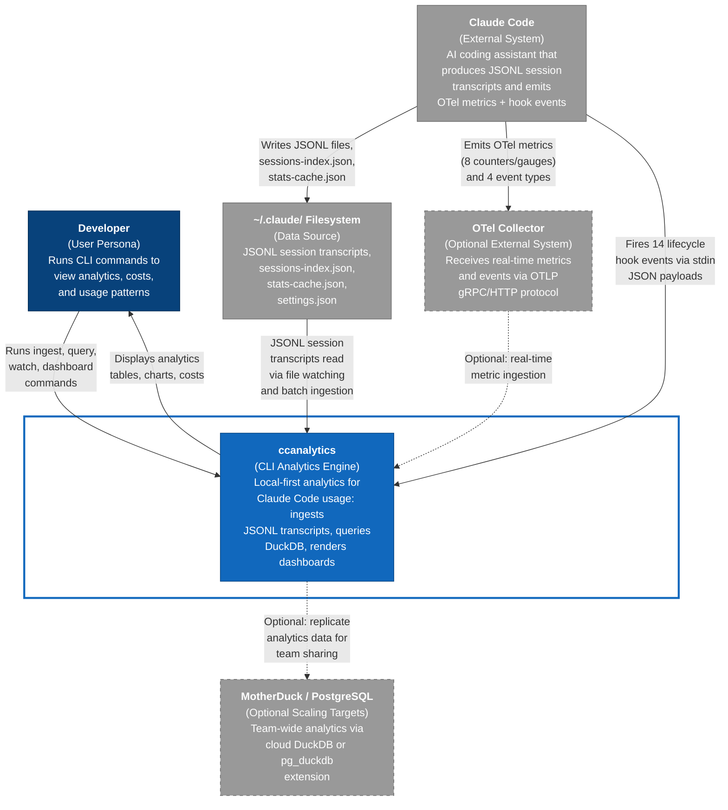

### Context Diagram Legend

| Element | Type | Description |
|---------|------|-------------|
| Developer | User Persona | Primary user who runs CLI commands and views analytics output |
| Claude Code | External System | AI coding assistant that generates the raw data (JSONL, OTel, hooks) |
| ~/.claude/ Filesystem | Data Source | Local filesystem where Claude Code writes session transcripts |
| OTel Collector | Optional External | Receives real-time metrics when `CLAUDE_CODE_ENABLE_TELEMETRY=1` |
| MotherDuck / PostgreSQL | Optional Scaling | Team-wide analytics targets for Stage 2-3 scaling |
| ccanalytics | System Under Design | The CLI analytics engine being architected |

---

## 2. C4 Container Diagram (Level 2)

The Container diagram zooms into ccanalytics and reveals its internal containers --
the separately deployable/runnable units that make up the system. All containers run
within a single Node.js process.

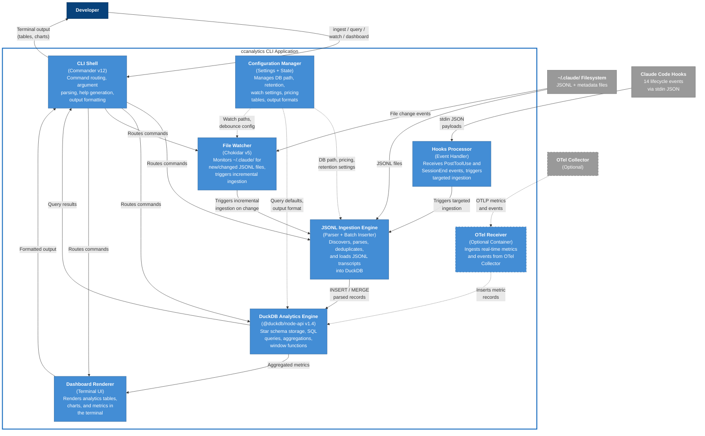

### Container Responsibilities

| Container | Technology | Responsibility |
|-----------|-----------|----------------|
| CLI Shell | Commander v12, picocolors, nanospinner | Command routing, argument parsing, output formatting, help generation |
| JSONL Ingestion Engine | Custom TypeScript, DuckDB `read_ndjson()` | File discovery, JSONL parsing, schema validation, deduplication, batch insertion |
| File Watcher | Chokidar v5 | Cross-platform file monitoring with `awaitWriteFinish` for partial write safety |
| Hooks Processor | Custom TypeScript | Receives Claude Code hook events via stdin, triggers targeted ingestion |
| OTel Receiver | Optional, OTLP protocol | Ingests real-time metrics and events from OTel Collector |
| DuckDB Analytics Engine | @duckdb/node-api v1.4 | Star schema storage (5 tables), SQL queries, aggregations, MERGE INTO upserts |
| Dashboard Renderer | cli-table3, picocolors | Terminal UI rendering for analytics tables, metric summaries, trend charts |
| Configuration Manager | Custom TypeScript | Settings management (DB path, retention, pricing, output format, watch config) |

---

## 3. C4 Component Diagrams (Level 3)

Each container is decomposed into its internal components. These diagrams show the
classes, modules, and internal structure within each container.

### 3.1. Ingestion Engine Components

The Ingestion Engine is the most complex container. It handles the full pipeline from
file discovery through deduplication to batch insertion into DuckDB.

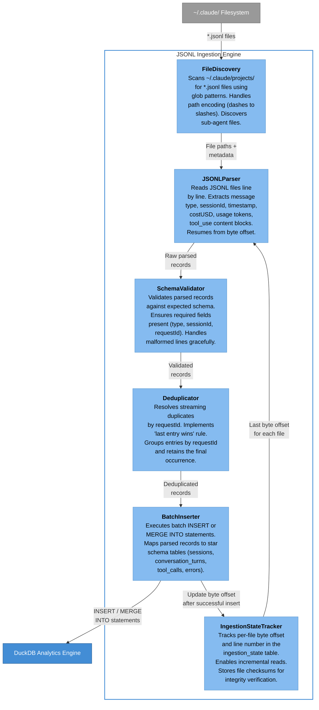

#### Ingestion Engine Component Details

| Component | Module | Key Behaviors |
|-----------|--------|---------------|
| FileDiscovery | `src/ingestion/file-discovery.ts` | Glob `~/.claude/projects/**/*.jsonl`, decode path encoding, detect `agent-*.jsonl` sub-agent files, check both `~/.claude/` and `~/.config/claude/` |
| JSONLParser | `src/ingestion/jsonl-parser.ts` | Line-by-line JSONL parsing, byte-offset resume, extract assistant billing payload, extract tool_use blocks from message.content array |
| SchemaValidator | `src/ingestion/schema-validator.ts` | Validate required fields per message type, reject malformed lines with error logging, enforce type constraints |
| Deduplicator | `src/ingestion/deduplicator.ts` | Group by `requestId`, retain last occurrence (last-entry-wins), handle entries without `requestId` as unique |
| BatchInserter | `src/ingestion/batch-inserter.ts` | Map records to star schema tables, execute `MERGE INTO` for idempotent upserts, batch inserts for performance |
| IngestionStateTracker | `src/ingestion/state-tracker.ts` | Read/write `ingestion_state` table, track `last_byte_offset`, `last_line_number`, `checksum` per file |

---

### 3.2. Query Engine Components

The Query Engine wraps DuckDB with pre-built analytical queries aligned to the key
metrics identified in the V0 analysis.

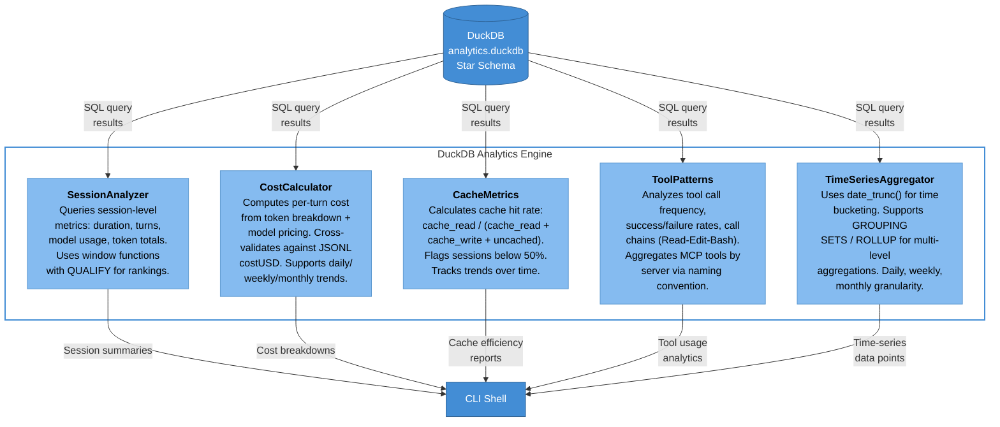

#### Query Engine Component Details

| Component | Module | Key SQL Features |
|-----------|--------|-----------------|
| SessionAnalyzer | `src/query/session-analyzer.ts` | Window functions with QUALIFY, session duration/depth metrics, model selection patterns |
| CostCalculator | `src/query/cost-calculator.ts` | Model-specific pricing lookup, per-turn cost formula, cross-validation with `costUSD`, ROLLUP for period totals |
| CacheMetrics | `src/query/cache-metrics.ts` | Cache hit rate formula, threshold alerts (>80% good, <50% wasted), per-session and trend views |
| ToolPatterns | `src/query/tool-patterns.ts` | Tool frequency ranking, `mcp__<server>__<tool>` server aggregation, call chain detection, success/failure rates |
| TimeSeriesAggregator | `src/query/time-series.ts` | `date_trunc()` bucketing, GROUPING SETS/ROLLUP, daily/weekly/monthly aggregation, ASOF JOIN for correlation |

---

### 3.3. CLI Shell Components

The CLI Shell container manages user interaction -- parsing commands, routing to the
appropriate subsystem, and formatting output for the terminal.

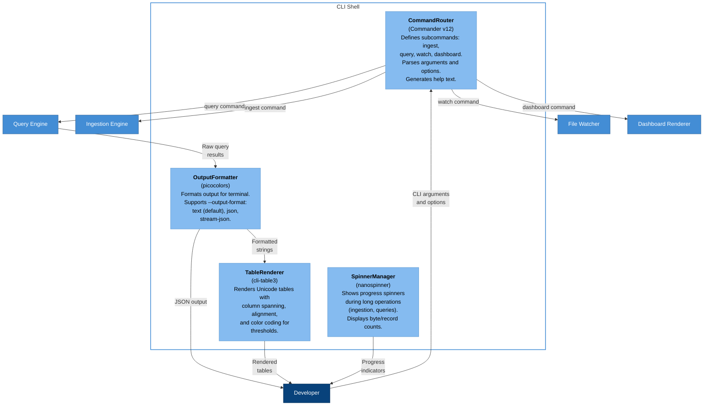

#### CLI Shell Component Details

| Component | Module | Technology |
|-----------|--------|-----------|
| CommandRouter | `src/cli/commands.ts` | Commander v12 -- subcommand definitions, option parsing, auto-generated `--help` |
| OutputFormatter | `src/cli/output-formatter.ts` | picocolors for color, supports `--output-format text|json|stream-json` |
| TableRenderer | `src/cli/table-renderer.ts` | cli-table3 -- Unicode tables, column spanning, conditional color for thresholds |
| SpinnerManager | `src/cli/spinner.ts` | nanospinner -- progress indication during ingestion and long queries |

---

### 3.4. Watcher Components

The Watcher container implements real-time file monitoring for the `watch` command,
using Chokidar to detect changes and trigger incremental ingestion.

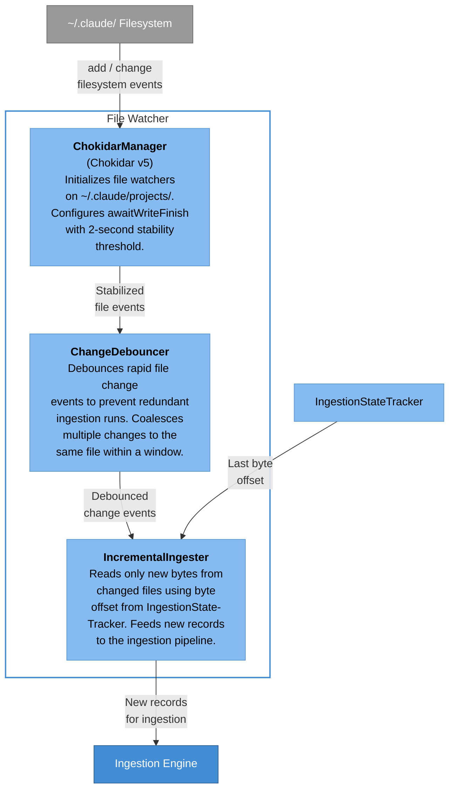

#### Watcher Component Details

| Component | Module | Key Behaviors |
|-----------|--------|---------------|
| ChokidarManager | `src/watcher/chokidar-manager.ts` | Watch `~/.claude/projects/**/*.jsonl`, `awaitWriteFinish: { stabilityThreshold: 2000 }`, cross-platform events |
| ChangeDebouncer | `src/watcher/debouncer.ts` | Coalesce rapid events per file path, configurable debounce window, prevent duplicate processing |
| IncrementalIngester | `src/watcher/incremental-ingester.ts` | Read from last byte offset, parse only new bytes, delegate to ingestion pipeline |

---

### 3.5. Hooks Processor Components

The Hooks Processor receives Claude Code lifecycle events and triggers targeted
ingestion based on specific hook types.

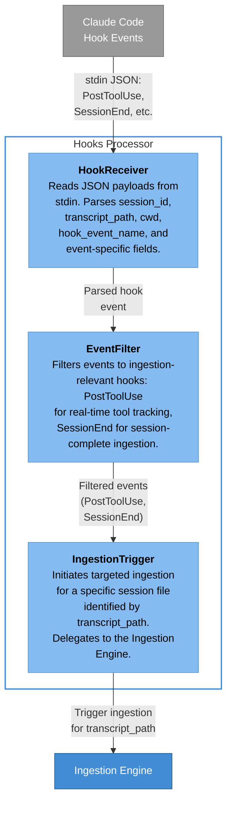

#### Hooks Processor Component Details

| Component | Module | Key Behaviors |
|-----------|--------|---------------|
| HookReceiver | `src/hooks/hook-receiver.ts` | Parse stdin JSON, validate required fields (session_id, hook_event_name), handle tool-specific fields |
| EventFilter | `src/hooks/event-filter.ts` | Whitelist `PostToolUse` and `SessionEnd` for ingestion triggers, ignore non-data events |
| IngestionTrigger | `src/hooks/ingestion-trigger.ts` | Map `transcript_path` to ingestion target, call Ingestion Engine for single-file incremental ingest |

---

### 3.6. Dashboard Renderer Components

The Dashboard Renderer provides the terminal UI for the `dashboard` command,
presenting aggregated analytics in a structured layout.

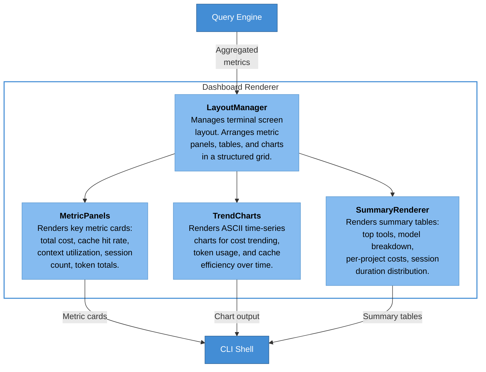

#### Dashboard Renderer Component Details

| Component | Module | Key Behaviors |
|-----------|--------|---------------|
| LayoutManager | `src/dashboard/layout-manager.ts` | Terminal size detection, panel arrangement, responsive grid layout |
| MetricPanels | `src/dashboard/metric-panels.ts` | Key metric display with threshold color coding (green >80% cache, red <50%) |
| TrendCharts | `src/dashboard/trend-charts.ts` | ASCII sparklines and bar charts for time-series data |
| SummaryRenderer | `src/dashboard/summary-renderer.ts` | Ranked tables for tools, models, projects using cli-table3 |

---

### 3.7. Configuration Manager Components

The Configuration Manager provides centralized access to settings, database paths,
and runtime state.

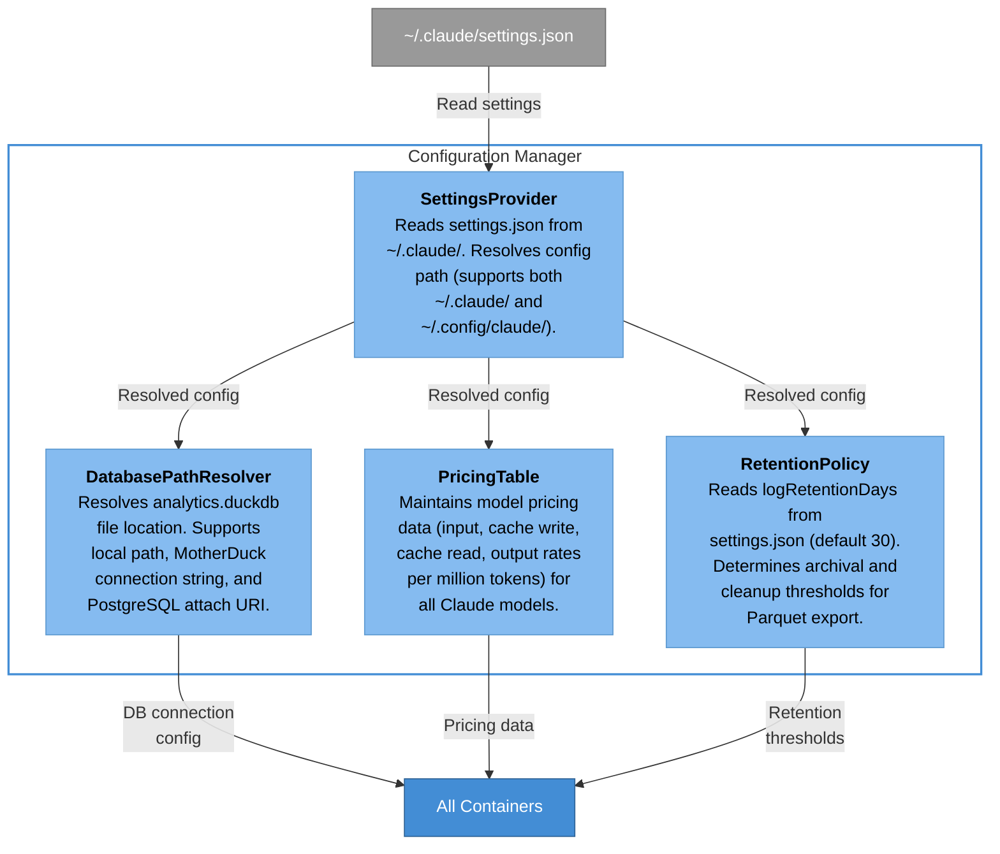

#### Configuration Manager Component Details

| Component | Module | Key Behaviors |
|-----------|--------|---------------|
| SettingsProvider | `src/config/settings-provider.ts` | Path resolution (`~/.claude/` vs `~/.config/claude/`), JSON parsing, default values |
| DatabasePathResolver | `src/config/db-path-resolver.ts` | Local file path, `md:` MotherDuck prefix, `postgres:` attach URI, env var overrides |
| PricingTable | `src/config/pricing-table.ts` | Per-model rates (Opus/Sonnet/Haiku), cache write 1.25x multiplier, cache read 0.10x multiplier |
| RetentionPolicy | `src/config/retention-policy.ts` | Default 30-day retention, Parquet archival threshold, ZSTD compression settings |

---

## 4. Data Flow Diagram

This diagram traces data from its origin in Claude Code through the entire ccanalytics
pipeline to terminal output.

```mermaid
flowchart LR
    subgraph origin ["Data Origin"]
        cc["<b>Claude Code</b><br/>AI Coding Assistant"]
    end

    subgraph storage ["Local Storage"]
        jsonl["<b>JSONL Files</b><br/>~/.claude/projects/<br/>{path}/{session}.jsonl"]
    end

    subgraph ingestion ["Ingestion Pipeline"]
        fd["<b>File<br/>Discovery</b>"]
        jp["<b>JSONL<br/>Parser</b>"]
        sv["<b>Schema<br/>Validator</b>"]
        dedup["<b>Deduplicator</b><br/>(requestId<br/>last wins)"]
        bi["<b>Batch<br/>Inserter</b>"]
    end

    subgraph analytics_db ["Analytics Store"]
        db[("DuckDB<br/>analytics.duckdb")]
        sessions["sessions"]
        turns["conversation_turns"]
        tools["tool_calls"]
        errors["errors"]
        state["ingestion_state"]
    end

    subgraph query_layer ["Query Layer"]
        qe["<b>Query<br/>Engine</b>"]
    end

    subgraph output ["Output"]
        cli_out["<b>CLI Output</b><br/>Tables, JSON,<br/>Dashboard"]
    end

    cc -- "Writes session<br/>transcripts" --> jsonl
    jsonl --> fd
    fd -- "File paths" --> jp
    jp -- "Raw records" --> sv
    sv -- "Valid records" --> dedup
    dedup -- "Unique records" --> bi
    bi -- "MERGE INTO" --> db

    db --- sessions
    db --- turns
    db --- tools
    db --- errors
    db --- state

    bi -- "Update offsets" --> state
    state -- "Resume offsets" -.-> jp

    db -- "SQL queries" --> qe
    qe -- "Results" --> cli_out

    style origin fill:none,stroke:#999,stroke-width:1px
    style storage fill:none,stroke:#999,stroke-width:1px
    style ingestion fill:none,stroke:#438dd5,stroke-width:2px
    style analytics_db fill:none,stroke:#438dd5,stroke-width:2px
    style query_layer fill:none,stroke:#438dd5,stroke-width:2px
    style output fill:none,stroke:#438dd5,stroke-width:2px
    style cc fill:#999999,color:#fff,stroke:#6b6b6b
    style jsonl fill:#999999,color:#fff,stroke:#6b6b6b
    style fd fill:#85bbf0,color:#000,stroke:#5d99d0
    style jp fill:#85bbf0,color:#000,stroke:#5d99d0
    style sv fill:#85bbf0,color:#000,stroke:#5d99d0
    style dedup fill:#85bbf0,color:#000,stroke:#5d99d0
    style bi fill:#85bbf0,color:#000,stroke:#5d99d0
    style db fill:#438dd5,color:#fff,stroke:#2e6295
    style sessions fill:#85bbf0,color:#000,stroke:#5d99d0
    style turns fill:#85bbf0,color:#000,stroke:#5d99d0
    style tools fill:#85bbf0,color:#000,stroke:#5d99d0
    style errors fill:#85bbf0,color:#000,stroke:#5d99d0
    style state fill:#85bbf0,color:#000,stroke:#5d99d0
    style qe fill:#438dd5,color:#fff,stroke:#2e6295
    style cli_out fill:#08427b,color:#fff,stroke:#052e56
```

### Data Flow Summary

| Stage | Input | Processing | Output |
|-------|-------|-----------|--------|
| 1. Origin | Developer interaction with Claude Code | Claude Code writes session data | JSONL files in `~/.claude/projects/` |
| 2. Discovery | `~/.claude/projects/` directory tree | Glob for `*.jsonl`, decode path encoding | Ordered list of file paths |
| 3. Parsing | JSONL file bytes (from last offset) | Line-by-line parsing, field extraction | Raw typed records (user, assistant, etc.) |
| 4. Validation | Raw parsed records | Schema validation, required field checks | Valid records (malformed lines rejected) |
| 5. Deduplication | Valid records with `requestId` | Group by `requestId`, last entry wins | Unique canonical records |
| 6. Insertion | Unique records | `MERGE INTO` for idempotent upserts | Star schema tables populated |
| 7. State Update | Successful insert position | Write byte offset + line number | `ingestion_state` table updated |
| 8. Querying | Analyst SQL or pre-built templates | DuckDB analytical functions | Aggregated metric results |
| 9. Output | Query results | Format as table, JSON, or dashboard | Terminal display to developer |

---

## 5. Architecture Decision Records (ADR) Summary

| ADR | Decision | Status | Rationale | Tradeoffs |
|-----|----------|--------|-----------|-----------|
| ADR-001 | **DuckDB over SQLite** | Accepted | OLAP-optimized engine with native JSONL querying (`read_ndjson()`), window functions, `QUALIFY`, `GROUPING SETS`, columnar storage, and Parquet export. SQLite lacks analytical query features and requires manual ETL. | DuckDB binary is larger (~30MB). Single-writer constraint requires ingestion serialization. Newer ecosystem with less community tooling than SQLite. |
| ADR-002 | **Commander v12 over yargs** | Accepted | 109M weekly downloads, zero dependencies, TypeScript types included, clean subcommand pattern, auto-generated help text. yargs has a larger dependency tree and more complex API. | Commander has fewer built-in features for complex argument validation. Less middleware/plugin ecosystem than yargs. |
| ADR-003 | **Chokidar v5 for file watching** | Accepted | Battle-tested cross-platform file watching (macOS FSEvents, Linux inotify, Windows ReadDirectoryChangesW). Critical `awaitWriteFinish` option prevents reading partial JSONL writes with configurable stability threshold. | Adds ~1MB to bundle. Native filesystem bindings may require compilation on some platforms. Chokidar v4 exists but v5 is proven stable. |
| ADR-004 | **CJS for bin entry point** | Accepted | ESM bin scripts have cross-version compatibility issues across Node.js versions. CJS entry point via tsup's `.cjs` output ensures reliable `npx` execution across Node 20+. | Cannot use top-level `await` in entry point. Must use `require()` or dynamic `import()` for ESM dependencies. |
| ADR-005 | **Star schema with 5 tables** | Accepted | Denormalized star schema optimized for analytical queries. Fact tables (`conversation_turns`, `tool_calls`, `errors`) reference the `sessions` dimension table. Utility table (`ingestion_state`) tracks pipeline progress. Schema matches DuckDB's columnar strengths. | Some data duplication between `sessions` (aggregated) and `conversation_turns` (per-turn). Requires `MERGE INTO` for consistency during reprocessing. |
| ADR-006 | **requestId deduplication (last wins)** | Accepted | Claude Code streaming produces duplicate JSONL entries sharing the same `requestId`. The final entry is the authoritative record (contains complete token counts and cost). This matches the behavior validated by goccc. | Requires full-file scan on first ingestion to resolve duplicates. Memory usage scales with number of unique `requestId` values per file. |
| ADR-007 | **Byte-offset incremental ingestion** | Accepted | Track `last_byte_offset` per file in `ingestion_state` table. On re-ingestion, seek to offset and parse only new bytes. Reduces processing time from O(file_size) to O(new_data). File checksum validates integrity on reprocessing. | If a file is truncated or rewritten, checksum mismatch triggers full re-ingestion. Does not handle mid-line corruption gracefully (relies on line-by-line parsing). |
| ADR-008 | **@duckdb/node-api (Neo) binding** | Accepted | Official DuckDB Node.js binding recommended for all new projects. Promise-native API, TypeScript-first design, lossless handling of STRUCT and LIST types. Older `duckdb` and `duckdb-async` packages are deprecated and frozen at DuckDB 1.4.x. | Newer package with less community documentation. API surface may change between minor versions. |
| ADR-009 | **Parquet archival with ZSTD** | Accepted | Archive data older than retention threshold to Parquet files with ZSTD compression for 5-10x storage savings. DuckDB can query Parquet files directly alongside live data. Partitioned by month for efficient pruning. | Adds archival logic complexity. Parquet files are immutable -- corrections require rewriting partitions. Two-tier storage (DuckDB + Parquet) increases operational surface. |
| ADR-010 | **picocolors + nanospinner over chalk + ora** | Accepted | picocolors is 7KB vs chalk's 101KB, 2x faster, zero dependencies. nanospinner is 20KB with single dependency (picocolors), CJS+ESM compatible. Aligns with minimal bundle size requirement (NFR-05). | Fewer formatting features than chalk (no RGB, no hex colors). nanospinner has fewer animation options than ora. |

---

## 6. Technology Stack Overview

| Layer | Technology | Version | Role | npm Package |
|-------|-----------|---------|------|-------------|
| **Runtime** | Node.js | >= 20 | JavaScript runtime target | -- |
| **Language** | TypeScript | latest | Type-safe development language | `typescript` |
| **Database** | DuckDB | 1.4.x | Embedded OLAP analytical engine | `@duckdb/node-api` |
| **CLI Framework** | Commander | v12 | Command routing, argument parsing, help generation | `commander` |
| **Build Tool** | tsup | latest | esbuild-powered bundler, CJS output, shebang preservation | `tsup` |
| **File Watching** | Chokidar | v5 | Cross-platform filesystem event monitoring | `chokidar` |
| **Terminal Colors** | picocolors | latest | Lightweight terminal color formatting (7KB) | `picocolors` |
| **Progress Spinner** | nanospinner | latest | Terminal progress indicators (20KB) | `nanospinner` |
| **Table Rendering** | cli-table3 | latest | Unicode table rendering with column spanning | `cli-table3` |
| **Testing** | Vitest | latest | TypeScript-native test framework | `vitest` |
| **OTel Protocol** | OTLP | -- | OpenTelemetry metrics/events ingestion (optional) | `@opentelemetry/api` |

### Build Configuration

```
tsup.config.ts
  entry: src/cli.ts
  format: CJS (.cjs)
  target: node20
  banner: #!/usr/bin/env node
```

### Distribution

```
package.json
  name: claude-analytics
  bin: { "claude-analytics": "./dist/cli.cjs" }
  files: ["dist"]
```

---

## Appendix A: Star Schema Entity Relationship

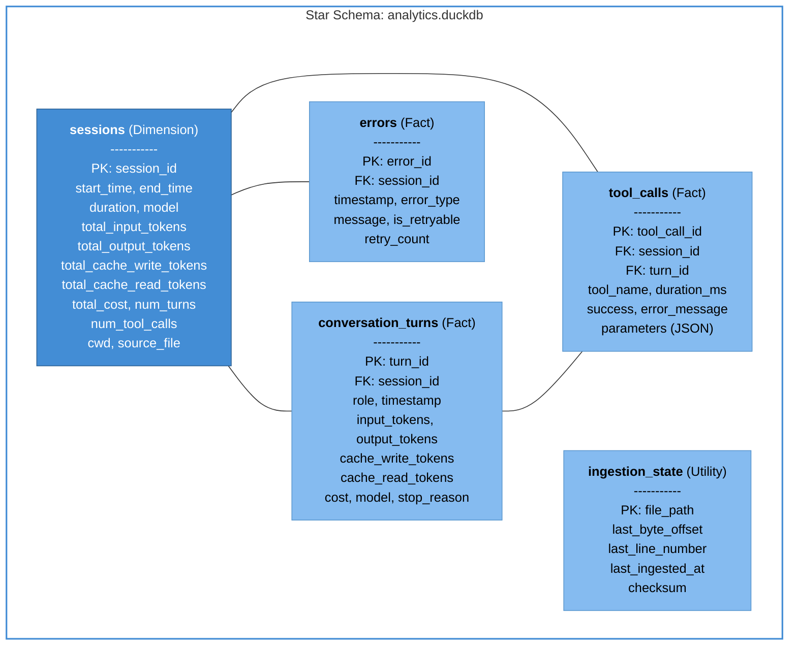

---

## Appendix B: Scaling Architecture

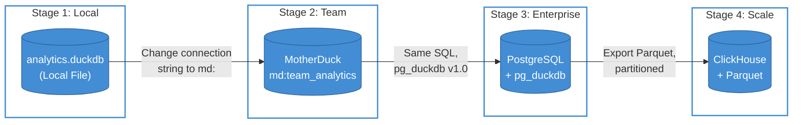

| Stage | Target | Migration Effort | Same SQL | Same Schema |
|-------|--------|-----------------|----------|-------------|
| 1. Local DuckDB | Individual developer | None (default) | Yes | Yes |
| 2. MotherDuck | Team sharing | Connection string change | Yes | Yes |
| 3. PostgreSQL | Enterprise (existing PG) | pg_duckdb extension install | Yes | Yes |
| 4. ClickHouse | Large-scale OLAP | Parquet export + ingest | Mostly | Yes |
