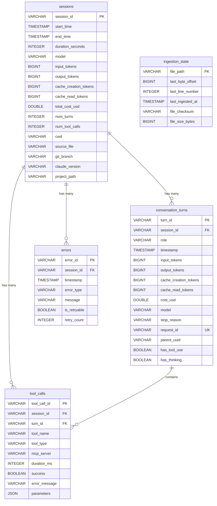

# ccanalytics Data Architecture

> Complete DuckDB schema design, analytical views, ingestion pipeline, deduplication
> strategy, and data lifecycle management for the ccanalytics local-first analytics engine.
>
> Source: [00-v0-analysis.md](00-v0-analysis.md), [01-c4-architecture.md](01-c4-architecture.md), [ccanalytics-V0.md](../ccanalytics-V0.md)
> Created: 2026-02-23

---

## Table of Contents

1. [Star Schema -- Complete DuckDB DDL](#1-star-schema----complete-duckdb-ddl)
2. [Indexes](#2-indexes)
3. [Analytical Views -- Complete CREATE VIEW Statements](#3-analytical-views----complete-create-view-statements)
4. [Data Type Mappings](#4-data-type-mappings)
5. [Incremental Ingestion Pipeline Design](#5-incremental-ingestion-pipeline-design)
6. [Deduplication Strategy](#6-deduplication-strategy)
7. [Data Flow Diagram (Mermaid)](#7-data-flow-diagram-mermaid)
8. [Entity Relationship Diagram (Mermaid erDiagram)](#8-entity-relationship-diagram-mermaid-erdiagram)
9. [Zero-ETL Ad-hoc Queries](#9-zero-etl-ad-hoc-queries)
10. [Parquet Archival Strategy](#10-parquet-archival-strategy)

---

## 1. Star Schema -- Complete DuckDB DDL

The schema follows a star pattern with `sessions` as the central fact table, `conversation_turns`
and `tool_calls` as detail fact tables, `errors` as an event table, and `ingestion_state` as an
operational metadata table. All tables are designed for DuckDB's columnar analytics engine.

### 1.1. sessions

The session-level fact table. Each row represents one Claude Code interactive session,
aggregated from its constituent conversation turns.

```sql
CREATE TABLE IF NOT EXISTS sessions (
    -- Primary key: UUID from JSONL sessionId field
    session_id          VARCHAR     PRIMARY KEY,

    -- Temporal boundaries
    start_time          TIMESTAMP   NOT NULL,
    end_time            TIMESTAMP,
    duration_seconds    INTEGER,

    -- Model used (most frequent model in the session, or first observed)
    model               VARCHAR,

    -- Token accounting (aggregated across all turns)
    input_tokens        BIGINT      DEFAULT 0,
    output_tokens       BIGINT      DEFAULT 0,
    cache_creation_tokens BIGINT    DEFAULT 0,
    cache_read_tokens   BIGINT      DEFAULT 0,

    -- Cost (sum of costUSD from all assistant turns)
    total_cost_usd      DOUBLE      DEFAULT 0.0,

    -- Activity metrics
    num_turns           INTEGER     DEFAULT 0,
    num_tool_calls      INTEGER     DEFAULT 0,

    -- Context: where and how the session ran
    cwd                 VARCHAR,
    source_file         VARCHAR,
    git_branch          VARCHAR,
    claude_version      VARCHAR,
    project_path        VARCHAR
);
```

**Design notes:**
- `duration_seconds` is stored as INTEGER rather than INTERVAL for easier arithmetic and aggregation.
- `total_cost_usd` uses DOUBLE (IEEE 754) rather than DECIMAL because Claude Code's `costUSD` field is a JSON float and sub-cent precision is sufficient for analytics.
- `project_path` is the decoded project path (e.g., `/Users/sam/Projects/my-app`), derived from the JSONL directory name by reversing the dash-encoding.
- `source_file` is the absolute path to the JSONL file for data lineage.

### 1.2. conversation_turns

Turn-level detail fact table. Each row corresponds to one message (user prompt or
assistant response) in a session. The billing payload from assistant messages provides
the token and cost columns.

```sql
CREATE TABLE IF NOT EXISTS conversation_turns (
    -- Primary key: generated as {session_id}_{line_number} or UUID
    turn_id             VARCHAR     PRIMARY KEY,

    -- Foreign key to parent session
    session_id          VARCHAR     NOT NULL REFERENCES sessions(session_id),

    -- Message metadata
    role                VARCHAR     NOT NULL,   -- 'user', 'assistant', 'file-history-snapshot', 'queue-operation'
    timestamp           TIMESTAMP   NOT NULL,

    -- Token breakdown (populated for assistant messages; NULL for user messages)
    input_tokens        BIGINT      DEFAULT 0,
    output_tokens       BIGINT      DEFAULT 0,
    cache_creation_tokens BIGINT    DEFAULT 0,
    cache_read_tokens   BIGINT      DEFAULT 0,

    -- Cost for this turn (from costUSD field)
    cost_usd            DOUBLE      DEFAULT 0.0,

    -- Model and API metadata
    model               VARCHAR,
    stop_reason         VARCHAR,
    request_id          VARCHAR     UNIQUE,     -- API request ID for deduplication
    parent_uuid         VARCHAR,                -- Links request-response pairs

    -- Content flags (derived from message.content array inspection)
    has_tool_use        BOOLEAN     DEFAULT FALSE,
    has_thinking        BOOLEAN     DEFAULT FALSE
);
```

**Design notes:**
- `request_id` has a UNIQUE constraint to enforce deduplication at the database level. Entries without a `requestId` (e.g., user messages) will have NULL, which DuckDB UNIQUE allows for multiple NULLs.
- `has_tool_use` and `has_thinking` are boolean flags derived during ingestion by inspecting `message.content` for blocks of type `tool_use` and `thinking` respectively. This avoids storing the full content while enabling filtering.
- `parent_uuid` enables reconstruction of request-response pairs when combined with user message UUIDs.

### 1.3. tool_calls

Tool call detail table. Each row represents one `tool_use` content block extracted from
an assistant message. MCP tools are distinguished by the `mcp__<server>__<tool>` naming
convention and the `tool_type` discriminator.

```sql
CREATE TABLE IF NOT EXISTS tool_calls (
    -- Primary key: from tool_use content block 'id' field (e.g., 'toolu_01...')
    tool_call_id        VARCHAR     PRIMARY KEY,

    -- Foreign keys
    session_id          VARCHAR     NOT NULL REFERENCES sessions(session_id),
    turn_id             VARCHAR     NOT NULL REFERENCES conversation_turns(turn_id),

    -- Tool identification
    tool_name           VARCHAR     NOT NULL,   -- e.g., 'Bash', 'Read', 'mcp__github__create_pr'
    tool_type           VARCHAR     NOT NULL DEFAULT 'native',  -- 'native' or 'mcp'
    mcp_server          VARCHAR,                -- Extracted from mcp__<server>__<tool> pattern; NULL for native tools

    -- Execution metadata
    duration_ms         INTEGER,
    success             BOOLEAN,
    error_message       VARCHAR,

    -- Tool input preserved as JSON for ad-hoc analysis
    parameters          JSON
);
```

**Design notes:**
- `tool_type` is derived during ingestion: if `tool_name` starts with `mcp__`, type is `'mcp'`; otherwise `'native'`.
- `mcp_server` is extracted as the second segment of the `mcp__<server>__<tool>` pattern. For example, `mcp__github__create_pr` yields `mcp_server = 'github'`.
- `parameters` uses DuckDB's native JSON type, enabling JSON path queries like `parameters->>'command'` without schema rigidity.
- `duration_ms` and `success` may be NULL when only the tool invocation is visible (without a corresponding `tool_result`).

### 1.4. errors

Error event table. Captures API errors, tool failures, and other error conditions
encountered during sessions. Sourced from OTel `claude_code.api_error` events, hook
`PostToolUseFailure` events, and JSONL error indicators.

```sql
CREATE TABLE IF NOT EXISTS errors (
    -- Primary key: generated UUID
    error_id            VARCHAR     PRIMARY KEY,

    -- Foreign key to parent session
    session_id          VARCHAR     NOT NULL REFERENCES sessions(session_id),

    -- Error metadata
    timestamp           TIMESTAMP   NOT NULL,
    error_type          VARCHAR     NOT NULL,   -- 'api_error', 'tool_failure', 'rate_limit', 'network', 'parse_error'
    message             VARCHAR,

    -- Retry behavior
    is_retryable        BOOLEAN     DEFAULT FALSE,
    retry_count         INTEGER     DEFAULT 0
);
```

**Design notes:**
- `error_type` is an application-level classification, not a raw HTTP status code. The ingestion layer maps raw error data into these categories.
- `is_retryable` and `retry_count` are derived from OTel `claude_code.api_error` event attributes (`status_code` and `attempt` fields).

### 1.5. ingestion_state

Operational metadata table for incremental ingestion. Tracks the byte offset and line
number of the last successfully ingested position in each JSONL file. This table is
never exposed to analytical queries -- it exists solely for the ingestion pipeline.

```sql
CREATE TABLE IF NOT EXISTS ingestion_state (
    -- Primary key: absolute path to the JSONL file
    file_path           VARCHAR     PRIMARY KEY,

    -- Ingestion cursor
    last_byte_offset    BIGINT      NOT NULL DEFAULT 0,
    last_line_number    INTEGER     NOT NULL DEFAULT 0,

    -- Audit fields
    last_ingested_at    TIMESTAMP   NOT NULL DEFAULT CURRENT_TIMESTAMP,
    file_checksum       VARCHAR,        -- SHA-256 of file content up to last_byte_offset
    file_size_bytes     BIGINT          -- Total file size at last check (for truncation detection)
);
```

**Design notes:**
- `file_checksum` enables detection of file rotation or truncation. If the stored checksum does not match a re-read of the file up to `last_byte_offset`, the file has been modified and requires full re-ingestion.
- `file_size_bytes` provides a fast check: if the current file size is less than `last_byte_offset`, the file has been truncated.
- `last_line_number` serves as a secondary cursor for debugging and progress reporting.

---

## 2. Indexes

DuckDB creates indexes differently from row-oriented databases. Since DuckDB is columnar and
uses zone maps (min/max metadata per column chunk) for predicate pushdown, explicit indexes
are most beneficial for point lookups and join acceleration. The following indexes target the
most common query patterns identified in the requirements.

```sql
-- =============================================================================
-- sessions indexes
-- =============================================================================

-- Time-range queries: "show sessions from last 7 days", daily aggregation
CREATE INDEX idx_sessions_start_time
    ON sessions (start_time);

-- Project-scoped queries: "show cost for project X"
CREATE INDEX idx_sessions_project_path
    ON sessions (project_path);

-- Combined time + project for filtered time-range queries
CREATE INDEX idx_sessions_project_time
    ON sessions (project_path, start_time);

-- =============================================================================
-- conversation_turns indexes
-- =============================================================================

-- Session drill-down: "show all turns for session X"
CREATE INDEX idx_turns_session_id
    ON conversation_turns (session_id);

-- Time-range queries on turns
CREATE INDEX idx_turns_timestamp
    ON conversation_turns (timestamp);

-- Deduplication lookups: find existing turn by request_id
CREATE INDEX idx_turns_request_id
    ON conversation_turns (request_id);

-- Combined session + time for ordered session replay
CREATE INDEX idx_turns_session_time
    ON conversation_turns (session_id, timestamp);

-- =============================================================================
-- tool_calls indexes
-- =============================================================================

-- Session-scoped tool analysis
CREATE INDEX idx_tools_session_id
    ON tool_calls (session_id);

-- Tool frequency and pattern analysis: "most used tools"
CREATE INDEX idx_tools_tool_name
    ON tool_calls (tool_name);

-- Combined for "tools used in session X"
CREATE INDEX idx_tools_session_tool
    ON tool_calls (session_id, tool_name);

-- Turn-level join acceleration
CREATE INDEX idx_tools_turn_id
    ON tool_calls (turn_id);

-- =============================================================================
-- errors indexes
-- =============================================================================

-- Session-scoped error drill-down
CREATE INDEX idx_errors_session_id
    ON errors (session_id);

-- Time-range error queries: "errors in last 24 hours"
CREATE INDEX idx_errors_timestamp
    ON errors (timestamp);

-- Error type filtering: "show all rate_limit errors"
CREATE INDEX idx_errors_type
    ON errors (error_type);

-- Combined session + time for ordered error timeline
CREATE INDEX idx_errors_session_time
    ON errors (session_id, timestamp);
```

**Index count: 14**

**Note on DuckDB index behavior:** DuckDB's ART (Adaptive Radix Tree) indexes accelerate
equality and range predicates on indexed columns. For full-table analytical scans, DuckDB's
columnar zone maps often outperform explicit indexes. These indexes primarily benefit
point lookups (e.g., fetching a specific session) and foreign-key join patterns.

---

## 3. Analytical Views -- Complete CREATE VIEW Statements

These views encapsulate the key analytical metrics identified in the V0 requirements.
They are designed to be queried directly by the CLI commands (`dashboard`, `query`) and
provide pre-computed aggregations without materialization overhead.

### 3.1. v_daily_cost

Daily cost aggregation broken down by model. Powers the cost trending dashboard and
budget monitoring (FR-15, FR-16, FR-21).

```sql
CREATE OR REPLACE VIEW v_daily_cost AS
SELECT
    CAST(ct.timestamp AS DATE)          AS date,
    ct.model                            AS model,
    SUM(ct.cost_usd)                    AS total_cost,
    SUM(ct.input_tokens)                AS input_tokens,
    SUM(ct.output_tokens)               AS output_tokens,
    SUM(ct.cache_read_tokens)           AS cache_read_tokens,
    COUNT(*)                            AS turn_count,
    COUNT(DISTINCT ct.session_id)       AS session_count
FROM conversation_turns ct
WHERE ct.role = 'assistant'
  AND ct.cost_usd > 0
GROUP BY
    CAST(ct.timestamp AS DATE),
    ct.model
ORDER BY date DESC, total_cost DESC;
```

**Usage examples:**
```sql
-- Last 7 days total spend
SELECT date, SUM(total_cost) FROM v_daily_cost
WHERE date >= CURRENT_DATE - INTERVAL '7 days'
GROUP BY date ORDER BY date;

-- Daily spend by model for current month
SELECT * FROM v_daily_cost
WHERE date >= DATE_TRUNC('month', CURRENT_DATE);
```

### 3.2. v_session_summary

Session-level summary with cache efficiency metrics. Powers the session list view and
session detail drill-down (FR-07, FR-09, FR-11, FR-12).

```sql
CREATE OR REPLACE VIEW v_session_summary AS
SELECT
    s.session_id,
    s.start_time,
    s.end_time,
    s.duration_seconds,
    s.model,
    s.total_cost_usd,
    (s.input_tokens + s.output_tokens + s.cache_creation_tokens + s.cache_read_tokens)
                                        AS total_tokens,
    -- Cache hit rate: proportion of input tokens served from cache
    -- Formula: cache_read / (cache_read + cache_creation + uncached_input)
    CASE
        WHEN (s.cache_read_tokens + s.cache_creation_tokens + s.input_tokens) > 0
        THEN ROUND(
            s.cache_read_tokens::DOUBLE /
            (s.cache_read_tokens + s.cache_creation_tokens + s.input_tokens)::DOUBLE,
            4
        )
        ELSE 0.0
    END                                 AS cache_hit_rate,
    s.num_turns,
    s.num_tool_calls,
    s.project_path,
    s.git_branch,
    s.claude_version,
    s.cwd,
    s.source_file
FROM sessions s
ORDER BY s.start_time DESC;
```

**Usage examples:**
```sql
-- Sessions with poor cache performance (< 50% hit rate)
SELECT session_id, start_time, cache_hit_rate, total_cost_usd
FROM v_session_summary
WHERE cache_hit_rate < 0.5 AND num_turns > 5;

-- Most expensive sessions this week
SELECT session_id, total_cost_usd, duration_seconds, num_turns
FROM v_session_summary
WHERE start_time >= CURRENT_DATE - INTERVAL '7 days'
ORDER BY total_cost_usd DESC
LIMIT 10;
```

### 3.3. v_tool_usage

Tool call frequency, success rates, and per-session averages. Powers the tool analysis
dashboard (FR-10, FR-29, FR-30).

```sql
CREATE OR REPLACE VIEW v_tool_usage AS
SELECT
    tc.tool_name,
    tc.tool_type,
    tc.mcp_server,
    COUNT(*)                            AS call_count,
    COUNT(*) FILTER (WHERE tc.success = TRUE)
                                        AS success_count,
    COUNT(*) FILTER (WHERE tc.success = FALSE)
                                        AS failure_count,
    -- Success rate as a proportion (0.0 to 1.0)
    CASE
        WHEN COUNT(*) FILTER (WHERE tc.success IS NOT NULL) > 0
        THEN ROUND(
            COUNT(*) FILTER (WHERE tc.success = TRUE)::DOUBLE /
            COUNT(*) FILTER (WHERE tc.success IS NOT NULL)::DOUBLE,
            4
        )
        ELSE NULL
    END                                 AS success_rate,
    -- Average calls per session (across sessions that used this tool)
    ROUND(
        COUNT(*)::DOUBLE /
        NULLIF(COUNT(DISTINCT tc.session_id), 0)::DOUBLE,
        2
    )                                   AS avg_per_session,
    COUNT(DISTINCT tc.session_id)       AS sessions_using_tool
FROM tool_calls tc
GROUP BY tc.tool_name, tc.tool_type, tc.mcp_server
ORDER BY call_count DESC;
```

**Usage examples:**
```sql
-- Top 10 tools by usage
SELECT tool_name, call_count, success_rate FROM v_tool_usage LIMIT 10;

-- MCP tools grouped by server
SELECT mcp_server, SUM(call_count), AVG(success_rate)
FROM v_tool_usage
WHERE tool_type = 'mcp'
GROUP BY mcp_server;
```

### 3.4. v_cache_efficiency

Daily cache efficiency metrics. Tracks the ratio of cache reads to total input token
processing over time. The key optimization metric -- rates above 80% indicate effective
caching; below 50% signals wasted spend (FR-07).

```sql
CREATE OR REPLACE VIEW v_cache_efficiency AS
SELECT
    CAST(ct.timestamp AS DATE)          AS date,
    SUM(ct.cache_read_tokens)           AS cache_read_tokens,
    SUM(ct.cache_creation_tokens)       AS cache_write_tokens,
    SUM(ct.input_tokens)                AS uncached_tokens,
    -- Cache hit rate formula:
    -- cache_read / (cache_read + cache_write + uncached_input)
    CASE
        WHEN (SUM(ct.cache_read_tokens) + SUM(ct.cache_creation_tokens) + SUM(ct.input_tokens)) > 0
        THEN ROUND(
            SUM(ct.cache_read_tokens)::DOUBLE /
            (SUM(ct.cache_read_tokens) + SUM(ct.cache_creation_tokens) + SUM(ct.input_tokens))::DOUBLE,
            4
        )
        ELSE 0.0
    END                                 AS cache_hit_rate,
    -- Total input tokens processed (all categories)
    (SUM(ct.cache_read_tokens) + SUM(ct.cache_creation_tokens) + SUM(ct.input_tokens))
                                        AS total_input_processed,
    -- Estimated savings from cache hits (each cache read saves 90% of input cost)
    SUM(ct.cache_read_tokens) * 0.9     AS estimated_tokens_saved
FROM conversation_turns ct
WHERE ct.role = 'assistant'
GROUP BY CAST(ct.timestamp AS DATE)
ORDER BY date DESC;
```

**Usage examples:**
```sql
-- Weekly cache efficiency trend
SELECT
    DATE_TRUNC('week', date) AS week,
    AVG(cache_hit_rate) AS avg_cache_hit_rate,
    SUM(cache_read_tokens) AS total_cache_reads
FROM v_cache_efficiency
GROUP BY DATE_TRUNC('week', date)
ORDER BY week;

-- Days with poor cache performance
SELECT * FROM v_cache_efficiency
WHERE cache_hit_rate < 0.5
ORDER BY date DESC;
```

### 3.5. v_hourly_activity

Activity distribution by hour of day. Reveals when developers are most active and
highest-cost hours (FR-11, FR-15).

```sql
CREATE OR REPLACE VIEW v_hourly_activity AS
SELECT
    EXTRACT(HOUR FROM ct.timestamp)     AS hour_of_day,
    COUNT(*)                            AS message_count,
    COUNT(DISTINCT ct.session_id)       AS session_count,
    ROUND(AVG(ct.cost_usd), 6)         AS avg_cost,
    SUM(ct.input_tokens + ct.output_tokens + ct.cache_read_tokens + ct.cache_creation_tokens)
                                        AS total_tokens,
    SUM(ct.cost_usd)                    AS total_cost,
    ROUND(AVG(ct.input_tokens + ct.output_tokens), 0)
                                        AS avg_tokens_per_turn
FROM conversation_turns ct
WHERE ct.role = 'assistant'
GROUP BY EXTRACT(HOUR FROM ct.timestamp)
ORDER BY hour_of_day;
```

**Usage examples:**
```sql
-- Peak activity hours
SELECT hour_of_day, message_count, total_cost
FROM v_hourly_activity
ORDER BY message_count DESC
LIMIT 5;

-- Cost distribution across work hours
SELECT * FROM v_hourly_activity
WHERE hour_of_day BETWEEN 8 AND 18;
```

---

## 4. Data Type Mappings

Complete mapping from JSONL assistant message fields to DuckDB column types. This table
serves as the canonical reference for the ingestion parser.

### 4.1. Assistant Message Top-Level Fields

| JSONL Field Path | JSONL Type | DuckDB Column | DuckDB Type | Target Table | Notes |
|---|---|---|---|---|---|
| `type` | string | `role` | VARCHAR | conversation_turns | Discriminator: `'assistant'`, `'user'`, etc. |
| `sessionId` | UUID string | `session_id` | VARCHAR | sessions, conversation_turns | Primary/foreign key |
| `timestamp` | ISO 8601 string | `timestamp` | TIMESTAMP | conversation_turns | Parsed from `'2025-12-22T21:19:24.929Z'` format |
| `costUSD` | float | `cost_usd` | DOUBLE | conversation_turns | Pre-calculated server-side cost |
| `requestId` | string | `request_id` | VARCHAR | conversation_turns | Deduplication key; may be absent on user messages |
| `parentUuid` | string | `parent_uuid` | VARCHAR | conversation_turns | Links request-response pairs |
| `version` | string | `claude_version` | VARCHAR | sessions | Claude Code version string |
| `gitBranch` | string | `git_branch` | VARCHAR | sessions | Current git branch |
| `cwd` | string | `cwd` | VARCHAR | sessions | Working directory (from hooks/session context) |
| `model` | string | `model` | VARCHAR | conversation_turns, sessions | Model identifier string |
| `stopReason` | string | `stop_reason` | VARCHAR | conversation_turns | API stop reason |

### 4.2. Usage Token Fields (nested under `usage`)

| JSONL Field Path | JSONL Type | DuckDB Column | DuckDB Type | Target Table | Notes |
|---|---|---|---|---|---|
| `usage.input_tokens` | integer | `input_tokens` | BIGINT | conversation_turns | Uncached input tokens |
| `usage.output_tokens` | integer | `output_tokens` | BIGINT | conversation_turns | Output tokens (includes thinking tokens) |
| `usage.cache_creation_input_tokens` | integer | `cache_creation_tokens` | BIGINT | conversation_turns | Tokens written to prompt cache |
| `usage.cache_read_input_tokens` | integer | `cache_read_tokens` | BIGINT | conversation_turns | Tokens served from prompt cache |

### 4.3. Content Block Fields (nested under `message.content[]`)

| JSONL Field Path | JSONL Type | DuckDB Column | DuckDB Type | Target Table | Notes |
|---|---|---|---|---|---|
| `message.content[].type` | string | -- | -- | -- | Discriminator: `'tool_use'`, `'thinking'`, `'text'` |
| `message.content[].id` (tool_use) | string | `tool_call_id` | VARCHAR | tool_calls | Primary key, e.g., `'toolu_01...'` |
| `message.content[].name` (tool_use) | string | `tool_name` | VARCHAR | tool_calls | Tool name; MCP pattern: `mcp__<server>__<tool>` |
| `message.content[].input` (tool_use) | object | `parameters` | JSON | tool_calls | Stored as DuckDB JSON type |
| `message.content[].thinking` (thinking) | string | -- | -- | -- | Not stored; `has_thinking` flag set instead |
| `message.content[].text` (text) | string | -- | -- | -- | Not stored in V0 (content analysis out of scope) |

### 4.4. Derived Fields (computed during ingestion)

| Derived Field | DuckDB Column | DuckDB Type | Target Table | Derivation Logic |
|---|---|---|---|---|
| -- | `turn_id` | VARCHAR | conversation_turns | Generated: `{session_id}_{line_number}` |
| -- | `has_tool_use` | BOOLEAN | conversation_turns | `TRUE` if any `message.content[].type === 'tool_use'` |
| -- | `has_thinking` | BOOLEAN | conversation_turns | `TRUE` if any `message.content[].type === 'thinking'` |
| -- | `tool_type` | VARCHAR | tool_calls | `'mcp'` if `tool_name.startsWith('mcp__')`, else `'native'` |
| -- | `mcp_server` | VARCHAR | tool_calls | Second segment of `mcp__<server>__<tool>` split by `__` |
| -- | `duration_seconds` | INTEGER | sessions | `(end_time - start_time)` in seconds |
| -- | `project_path` | VARCHAR | sessions | Decoded from JSONL directory name (dashes to slashes) |
| -- | `source_file` | VARCHAR | sessions | Absolute path to the JSONL file being ingested |
| -- | `error_id` | VARCHAR | errors | Generated UUID |

### 4.5. Type Conversion Summary

| JSON Type | DuckDB Type | Conversion Notes |
|---|---|---|
| string (UUID) | VARCHAR | Stored as-is; no UUID type needed for portability |
| string (ISO 8601) | TIMESTAMP | DuckDB auto-parses ISO 8601 strings via `CAST(x AS TIMESTAMP)` |
| number (integer) | BIGINT | BIGINT for token counts to accommodate large context windows |
| number (float) | DOUBLE | IEEE 754 double precision for cost values |
| boolean | BOOLEAN | Direct mapping |
| object | JSON | DuckDB native JSON type for semi-structured data |
| null / missing | NULL | All nullable columns default to NULL for missing fields |

---

## 5. Incremental Ingestion Pipeline Design

### 5.1. Byte-Offset Tracking Strategy

The ingestion pipeline uses the `ingestion_state` table to track exactly how far each
JSONL file has been processed. This enables efficient incremental ingestion without
re-reading entire files on each run.

**Core invariant:** For any given file, all bytes from position 0 through
`last_byte_offset` have been fully parsed, deduplicated, and inserted into the
analytical tables.

```
File on disk:       [===== ingested ====|=== new data ===|... being written ...]
                    ^                   ^                ^
                    0          last_byte_offset    current file size
```

### 5.2. Ingestion Algorithm

The complete algorithm for processing a single JSONL file:

```
FUNCTION ingest_file(file_path):

    1. READ current file metadata
       file_size = stat(file_path).size
       file_mtime = stat(file_path).mtime

    2. QUERY ingestion state
       state = SELECT * FROM ingestion_state WHERE file_path = $file_path

    3. DETECT file changes
       IF state EXISTS:
           IF file_size < state.last_byte_offset:
               -- File was truncated or rotated; full re-ingestion required
               LOG warning "File truncated, re-ingesting from start"
               DELETE dependent data for this file
               SET seek_offset = 0
           ELSE IF file_size == state.last_byte_offset:
               -- No new data
               RETURN early (nothing to do)
           ELSE:
               -- Normal incremental case
               SET seek_offset = state.last_byte_offset
       ELSE:
           -- First time seeing this file
           SET seek_offset = 0

    4. OPEN file and SEEK to offset
       fd = open(file_path, 'r')
       fd.seek(seek_offset)

    5. READ new lines
       new_lines = []
       current_offset = seek_offset
       WHILE line = fd.readline():
           IF line is valid JSON:
               parsed = JSON.parse(line)
               new_lines.append({
                   data: parsed,
                   byte_offset: current_offset,
                   line_number: state.last_line_number + len(new_lines) + 1
               })
           ELSE:
               LOG warning "Skipping malformed line at offset {current_offset}"
           current_offset = fd.tell()
       final_offset = fd.tell()
       fd.close()

    6. PROCESS in batches within a transaction
       BEGIN TRANSACTION
       FOR batch IN chunk(new_lines, BATCH_SIZE=1000):
           -- Classify each line by type
           FOR entry IN batch:
               SWITCH entry.data.type:
                   CASE 'assistant':
                       -- Extract turn, tool_calls, update session
                       INSERT OR MERGE conversation turn
                       INSERT tool_calls (if any tool_use blocks)
                       UPDATE session aggregates
                   CASE 'user':
                       INSERT conversation turn (minimal fields)
                   CASE 'file-history-snapshot':
                       SKIP (not ingested in V0)
                   CASE 'queue-operation':
                       SKIP (not ingested in V0)

       -- Update ingestion cursor
       MERGE INTO ingestion_state
       VALUES ($file_path, $final_offset, $final_line_number, NOW(), $checksum, $file_size)

       COMMIT TRANSACTION

    7. RETURN statistics
       RETURN { lines_processed: len(new_lines), new_offset: final_offset }
```

### 5.3. SQL for Ingestion State Updates

```sql
-- Check ingestion state for a file
SELECT file_path, last_byte_offset, last_line_number, file_size_bytes
FROM ingestion_state
WHERE file_path = $1;

-- Upsert ingestion state after successful batch
INSERT INTO ingestion_state (file_path, last_byte_offset, last_line_number, last_ingested_at, file_checksum, file_size_bytes)
VALUES ($1, $2, $3, CURRENT_TIMESTAMP, $4, $5)
ON CONFLICT (file_path) DO UPDATE SET
    last_byte_offset  = EXCLUDED.last_byte_offset,
    last_line_number  = EXCLUDED.last_line_number,
    last_ingested_at  = EXCLUDED.last_ingested_at,
    file_checksum     = EXCLUDED.file_checksum,
    file_size_bytes   = EXCLUDED.file_size_bytes;
```

### 5.4. Chokidar File Watching Configuration

The watcher uses Chokidar v5 with `awaitWriteFinish` to avoid reading JSONL files
while Claude Code is still writing to them. The 2-second stability threshold means
Chokidar waits until the file size has not changed for 2 seconds before firing the
`change` event.

```typescript
import chokidar from 'chokidar';

const CLAUDE_DATA_DIRS = [
    `${os.homedir()}/.claude/projects`,
    `${os.homedir()}/.config/claude/projects`,  // v1.0.30+ path
];

const watcher = chokidar.watch(
    CLAUDE_DATA_DIRS.map(dir => `${dir}/**/*.jsonl`),
    {
        // Wait for write to finish before emitting events
        awaitWriteFinish: {
            stabilityThreshold: 2000,   // 2 seconds of no size change
            pollInterval: 250,          // Check every 250ms during stabilization
        },

        // Ignore dotfiles and non-JSONL files
        ignored: [
            /(^|[\/\\])\../,           // Hidden files
            /\.tmp$/,                   // Temp files
        ],

        // Performance settings
        persistent: true,               // Keep watching (for `watch` command)
        usePolling: false,              // Use native fsevents on macOS
        depth: 3,                       // projects/{encoded-path}/{file}.jsonl

        // Do not fire for existing files on startup (handled by initial ingest)
        ignoreInitial: true,
    }
);

// Event handlers
watcher
    .on('add', (filePath: string) => {
        // New JSONL file discovered -- full ingest
        ingestFile(filePath);
    })
    .on('change', (filePath: string) => {
        // Existing file grew -- incremental ingest from last offset
        ingestFile(filePath);
    })
    .on('unlink', (filePath: string) => {
        // File deleted (log rotation) -- mark in ingestion_state
        markFileDeleted(filePath);
    })
    .on('error', (error: Error) => {
        console.error(`Watcher error: ${error.message}`);
    });
```

### 5.5. Batch Insert Strategy

Batch insertion uses DuckDB's prepared statements within a transaction for atomicity and
performance. The batch size of 1000 rows balances memory usage against transaction overhead.

```typescript
const BATCH_SIZE = 1000;

async function batchInsertTurns(
    connection: DuckDBConnection,
    turns: ParsedTurn[]
): Promise<void> {
    // Begin transaction -- all inserts are atomic
    await connection.run('BEGIN TRANSACTION');

    try {
        const stmt = await connection.prepare(`
            INSERT INTO conversation_turns (
                turn_id, session_id, role, timestamp,
                input_tokens, output_tokens,
                cache_creation_tokens, cache_read_tokens,
                cost_usd, model, stop_reason, request_id,
                parent_uuid, has_tool_use, has_thinking
            ) VALUES (?, ?, ?, ?, ?, ?, ?, ?, ?, ?, ?, ?, ?, ?, ?)
            ON CONFLICT (request_id) DO UPDATE SET
                input_tokens          = EXCLUDED.input_tokens,
                output_tokens         = EXCLUDED.output_tokens,
                cache_creation_tokens = EXCLUDED.cache_creation_tokens,
                cache_read_tokens     = EXCLUDED.cache_read_tokens,
                cost_usd              = EXCLUDED.cost_usd,
                stop_reason           = EXCLUDED.stop_reason,
                has_tool_use          = EXCLUDED.has_tool_use,
                has_thinking          = EXCLUDED.has_thinking
        `);

        for (let i = 0; i < turns.length; i += BATCH_SIZE) {
            const batch = turns.slice(i, i + BATCH_SIZE);
            for (const turn of batch) {
                await stmt.run(
                    turn.turnId, turn.sessionId, turn.role, turn.timestamp,
                    turn.inputTokens, turn.outputTokens,
                    turn.cacheCreationTokens, turn.cacheReadTokens,
                    turn.costUsd, turn.model, turn.stopReason, turn.requestId,
                    turn.parentUuid, turn.hasToolUse, turn.hasThinking
                );
            }
        }

        await stmt.finalize();
        await connection.run('COMMIT');
    } catch (error) {
        await connection.run('ROLLBACK');
        throw error;
    }
}
```

**Performance characteristics:**
- 1000-row batches within a single transaction minimize WAL overhead.
- Prepared statements avoid re-parsing SQL for each row.
- `ON CONFLICT` clause handles deduplication inline (see Section 6).
- Typical throughput: 10,000-50,000 rows/second for this schema on modern hardware.

---

## 6. Deduplication Strategy

### 6.1. The Duplication Problem

Claude Code's streaming mode can produce **multiple JSONL entries with the same `requestId`**.
This occurs because partial streaming responses are written as complete JSONL lines, and
the final response is also written. The canonical record is always the **last entry** for a
given `requestId` -- it contains the complete token counts and final cost.

### 6.2. requestId-Based Deduplication

**Rule: Last entry per `requestId` wins.**

During ingestion, when multiple JSONL lines share the same `requestId`, only the last
one (by file position / byte offset) is treated as authoritative. Earlier entries with
the same `requestId` are superseded.

**Implementation approach -- two phases:**

**Phase 1: Pre-insert dedup in the parser.** Before inserting a batch, group entries by
`requestId` and retain only the last entry in file order:

```typescript
function deduplicateByRequestId(entries: ParsedEntry[]): ParsedEntry[] {
    const lastByRequestId = new Map<string, ParsedEntry>();
    const noRequestId: ParsedEntry[] = [];

    for (const entry of entries) {
        if (entry.requestId) {
            // Later entries overwrite earlier ones (last wins)
            lastByRequestId.set(entry.requestId, entry);
        } else {
            // Entries without requestId are always kept
            noRequestId.push(entry);
        }
    }

    return [...lastByRequestId.values(), ...noRequestId];
}
```

**Phase 2: Database-level upsert.** Even after in-memory dedup, a `requestId` may already
exist in the database from a previous ingestion run (e.g., re-processing after a crash).
The `ON CONFLICT` clause on `request_id` ensures idempotency.

### 6.3. SQL MERGE INTO Pattern for Idempotent Upserts

For bulk reprocessing or re-ingestion of complete files, use DuckDB's `MERGE INTO` for
a full idempotent upsert:

```sql
-- Idempotent upsert for conversation_turns using MERGE INTO
-- Source: a staging table or CTE with new/reprocessed data
MERGE INTO conversation_turns AS target
USING (
    SELECT
        turn_id,
        session_id,
        role,
        timestamp,
        input_tokens,
        output_tokens,
        cache_creation_tokens,
        cache_read_tokens,
        cost_usd,
        model,
        stop_reason,
        request_id,
        parent_uuid,
        has_tool_use,
        has_thinking
    FROM staging_turns
) AS source
ON target.request_id = source.request_id
    AND source.request_id IS NOT NULL
WHEN MATCHED THEN UPDATE SET
    input_tokens          = source.input_tokens,
    output_tokens         = source.output_tokens,
    cache_creation_tokens = source.cache_creation_tokens,
    cache_read_tokens     = source.cache_read_tokens,
    cost_usd              = source.cost_usd,
    stop_reason           = source.stop_reason,
    has_tool_use          = source.has_tool_use,
    has_thinking          = source.has_thinking
WHEN NOT MATCHED THEN INSERT (
    turn_id, session_id, role, timestamp,
    input_tokens, output_tokens,
    cache_creation_tokens, cache_read_tokens,
    cost_usd, model, stop_reason, request_id,
    parent_uuid, has_tool_use, has_thinking
) VALUES (
    source.turn_id, source.session_id, source.role, source.timestamp,
    source.input_tokens, source.output_tokens,
    source.cache_creation_tokens, source.cache_read_tokens,
    source.cost_usd, source.model, source.stop_reason, source.request_id,
    source.parent_uuid, source.has_tool_use, source.has_thinking
);
```

### 6.4. Handling Entries Without requestId

Some JSONL entries lack a `requestId`. This is normal for:
- **User messages** (`type: 'user'`) -- these are user-initiated prompts, not API responses.
- **System messages** (`type: 'file-history-snapshot'`, `type: 'queue-operation'`).

**Strategy for entries without requestId:**
1. User messages are deduplicated by `turn_id` (which is generated as `{session_id}_{line_number}`). Since `turn_id` encodes the file position, re-ingesting the same file position produces the same `turn_id`.
2. The `request_id` UNIQUE constraint allows multiple NULL values, so entries without a `requestId` do not conflict with each other.
3. For full re-ingestion, clear all turns for the affected session before re-inserting.

### 6.5. Session-Level Deduplication

Sessions are deduplicated by `session_id` (the UUID from JSONL). Session aggregates are
recomputed on each ingestion pass using the latest turn data:

```sql
-- Recompute session aggregates from turns
INSERT INTO sessions (
    session_id, start_time, end_time, duration_seconds,
    model, input_tokens, output_tokens,
    cache_creation_tokens, cache_read_tokens,
    total_cost_usd, num_turns, num_tool_calls,
    cwd, source_file, git_branch, claude_version, project_path
)
SELECT
    ct.session_id,
    MIN(ct.timestamp)                                       AS start_time,
    MAX(ct.timestamp)                                       AS end_time,
    EXTRACT(EPOCH FROM MAX(ct.timestamp) - MIN(ct.timestamp))::INTEGER
                                                            AS duration_seconds,
    MODE(ct.model)                                          AS model,
    SUM(ct.input_tokens)                                    AS input_tokens,
    SUM(ct.output_tokens)                                   AS output_tokens,
    SUM(ct.cache_creation_tokens)                           AS cache_creation_tokens,
    SUM(ct.cache_read_tokens)                               AS cache_read_tokens,
    SUM(ct.cost_usd)                                        AS total_cost_usd,
    COUNT(*)                                                AS num_turns,
    (SELECT COUNT(*) FROM tool_calls tc WHERE tc.session_id = ct.session_id)
                                                            AS num_tool_calls,
    NULL, NULL, NULL, NULL, NULL  -- Populated from session metadata
FROM conversation_turns ct
GROUP BY ct.session_id
ON CONFLICT (session_id) DO UPDATE SET
    start_time            = EXCLUDED.start_time,
    end_time              = EXCLUDED.end_time,
    duration_seconds      = EXCLUDED.duration_seconds,
    model                 = EXCLUDED.model,
    input_tokens          = EXCLUDED.input_tokens,
    output_tokens         = EXCLUDED.output_tokens,
    cache_creation_tokens = EXCLUDED.cache_creation_tokens,
    cache_read_tokens     = EXCLUDED.cache_read_tokens,
    total_cost_usd        = EXCLUDED.total_cost_usd,
    num_turns             = EXCLUDED.num_turns,
    num_tool_calls        = EXCLUDED.num_tool_calls;
```

---

## 7. Data Flow Diagram (Mermaid)

End-to-end data flow from Claude Code session output through the ingestion pipeline
into analytical storage and query output.

```mermaid
flowchart LR
    subgraph source ["Data Sources"]
        CC["Claude Code<br/>(Session Activity)"]
        JSONL["~/.claude/projects/<br/>*.jsonl files"]
        CC -->|writes| JSONL
    end

    subgraph discovery ["File Discovery"]
        FD["FileDiscovery<br/>(Glob + Chokidar)"]
        JSONL -->|"file path<br/>events"| FD
    end

    subgraph parsing ["JSONL Parsing"]
        JP["JSONLParser<br/>(Line-by-line reader)"]
        FD -->|"file path +<br/>byte offset"| JP

        TD["TypeDiscriminator<br/>(assistant / user /<br/>file-history / queue)"]
        JP -->|"parsed JSON<br/>objects"| TD
    end

    subgraph dedup ["Deduplication"]
        DD["Deduplicator<br/>(requestId last-wins)"]
        TD -->|"typed entries"| DD
    end

    subgraph loading ["Batch Loading"]
        BI["BatchInserter<br/>(1000-row batches<br/>in transactions)"]
        DD -->|"deduplicated<br/>entries"| BI
    end

    subgraph storage ["DuckDB Storage"]
        S["sessions"]
        CT["conversation_turns"]
        TC["tool_calls"]
        E["errors"]
        IS["ingestion_state"]

        BI -->|"session<br/>aggregates"| S
        BI -->|"turn-level<br/>data"| CT
        BI -->|"tool_use<br/>blocks"| TC
        BI -->|"error<br/>events"| E
        BI -->|"cursor<br/>updates"| IS
    end

    subgraph views ["Analytical Views"]
        VDC["v_daily_cost"]
        VSS["v_session_summary"]
        VTU["v_tool_usage"]
        VCE["v_cache_efficiency"]
        VHA["v_hourly_activity"]

        S --> VDC
        CT --> VDC
        S --> VSS
        CT --> VCE
        CT --> VHA
        TC --> VTU
    end

    subgraph query ["Query & Output"]
        QE["Query Engine<br/>(DuckDB SQL)"]
        CLI["CLI Output<br/>(tables, JSON,<br/>dashboard)"]

        VDC --> QE
        VSS --> QE
        VTU --> QE
        VCE --> QE
        VHA --> QE
        QE --> CLI
    end

    style source fill:#f9f0ff,stroke:#9b59b6
    style discovery fill:#fff3e0,stroke:#f39c12
    style parsing fill:#e3f2fd,stroke:#2196f3
    style dedup fill:#fce4ec,stroke:#e91e63
    style loading fill:#e8f5e9,stroke:#4caf50
    style storage fill:#fff8e1,stroke:#ff9800
    style views fill:#f3e5f5,stroke:#9c27b0
    style query fill:#e0f7fa,stroke:#00bcd4
```



**Pipeline stages explained:**

| Stage | Component | Responsibility |
|-------|-----------|----------------|
| 1. Source | Claude Code | Writes JSONL session transcripts to `~/.claude/projects/` |
| 2. Discovery | FileDiscovery | Finds JSONL files via glob pattern; Chokidar watches for new/changed files |
| 3. Parsing | JSONLParser | Reads file from last byte offset; parses each line as JSON |
| 4. Classification | TypeDiscriminator | Routes entries by `type` field: assistant, user, or skip |
| 5. Deduplication | Deduplicator | Groups by `requestId`; retains last entry per ID |
| 6. Loading | BatchInserter | Inserts 1000-row batches within DuckDB transactions |
| 7. Storage | DuckDB tables | Five core tables receive classified, deduplicated data |
| 8. Views | Analytical views | Pre-defined SQL views compute aggregated metrics |
| 9. Query | Query Engine | Accepts SQL from CLI commands; reads views and tables |
| 10. Output | CLI Output | Formats results as terminal tables, JSON, or dashboard widgets |

---

## 8. Entity Relationship Diagram (Mermaid erDiagram)

All five tables with their relationships, cardinalities, and key columns.



**Relationship descriptions:**

| Relationship | Cardinality | Description |
|---|---|---|
| sessions -> conversation_turns | 1:N | A session contains many conversation turns (user prompts and assistant responses) |
| sessions -> tool_calls | 1:N | A session may contain many tool calls (via its turns) |
| sessions -> errors | 1:N | A session may produce zero or more errors |
| conversation_turns -> tool_calls | 1:N | An assistant turn may contain zero or more tool_use content blocks |
| ingestion_state | standalone | Operational table with no foreign key relationships to analytical tables |

---

## 9. Zero-ETL Ad-hoc Queries

DuckDB's `read_ndjson()` function can query JSONL files directly without any ingestion
step. This is valuable for quick ad-hoc analysis, debugging, and validating ingestion
results against raw source data.

### 9.1. Basic Pattern

```sql
-- Query all assistant messages across all projects
SELECT *
FROM read_ndjson(
    '~/.claude/projects/**/*.jsonl',
    columns = {
        type: 'VARCHAR',
        sessionId: 'VARCHAR',
        timestamp: 'VARCHAR',
        costUSD: 'DOUBLE',
        requestId: 'VARCHAR',
        usage: 'JSON',
        message: 'JSON'
    }
)
WHERE type = 'assistant';
```

### 9.2. Cost Summary Without Ingestion

```sql
-- Total cost by day, querying raw JSONL files directly
SELECT
    CAST(timestamp AS DATE) AS date,
    SUM(costUSD) AS daily_cost,
    COUNT(*) AS turn_count
FROM read_ndjson(
    '~/.claude/projects/**/*.jsonl',
    columns = {
        type: 'VARCHAR',
        timestamp: 'TIMESTAMP',
        costUSD: 'DOUBLE'
    }
)
WHERE type = 'assistant'
  AND costUSD IS NOT NULL
GROUP BY CAST(timestamp AS DATE)
ORDER BY date DESC
LIMIT 30;
```

### 9.3. Token Usage Breakdown

```sql
-- Token breakdown by type, directly from files
SELECT
    CAST(json_extract(usage, '$.input_tokens') AS BIGINT) AS input_tokens,
    CAST(json_extract(usage, '$.output_tokens') AS BIGINT) AS output_tokens,
    CAST(json_extract(usage, '$.cache_creation_input_tokens') AS BIGINT) AS cache_write,
    CAST(json_extract(usage, '$.cache_read_input_tokens') AS BIGINT) AS cache_read,
    costUSD,
    timestamp,
    filename  -- Virtual column: which file this line came from
FROM read_ndjson(
    '~/.claude/projects/**/*.jsonl',
    columns = {
        type: 'VARCHAR',
        timestamp: 'TIMESTAMP',
        costUSD: 'DOUBLE',
        usage: 'JSON'
    }
)
WHERE type = 'assistant'
ORDER BY timestamp DESC
LIMIT 20;
```

### 9.4. Tool Call Extraction

```sql
-- Extract tool calls from raw JSONL without ingestion
WITH assistant_messages AS (
    SELECT
        sessionId,
        timestamp,
        json_extract(message, '$.content') AS content
    FROM read_ndjson(
        '~/.claude/projects/**/*.jsonl',
        columns = {
            type: 'VARCHAR',
            sessionId: 'VARCHAR',
            timestamp: 'TIMESTAMP',
            message: 'JSON'
        }
    )
    WHERE type = 'assistant'
),
tool_uses AS (
    SELECT
        sessionId,
        timestamp,
        unnest(
            CAST(content AS JSON[])
        ) AS block
    FROM assistant_messages
    WHERE content IS NOT NULL
)
SELECT
    sessionId,
    timestamp,
    json_extract_string(block, '$.name') AS tool_name,
    json_extract_string(block, '$.id') AS tool_id
FROM tool_uses
WHERE json_extract_string(block, '$.type') = 'tool_use'
ORDER BY timestamp DESC
LIMIT 50;
```

### 9.5. Specific Session Deep Dive

```sql
-- Analyze a single session directly from its JSONL file
SELECT
    type,
    timestamp,
    costUSD,
    json_extract(usage, '$.input_tokens') AS input_tokens,
    json_extract(usage, '$.output_tokens') AS output_tokens,
    requestId
FROM read_ndjson(
    '~/.claude/projects/-Users-dev-myproject/abc12345-6789-abcd-ef01-234567890abc.jsonl',
    columns = {
        type: 'VARCHAR',
        timestamp: 'TIMESTAMP',
        costUSD: 'DOUBLE',
        usage: 'JSON',
        requestId: 'VARCHAR'
    }
)
ORDER BY timestamp;
```

### 9.6. Cross-Validation: JSONL vs Ingested Data

```sql
-- Compare raw JSONL totals against ingested session aggregates
WITH raw_totals AS (
    SELECT
        sessionId AS session_id,
        SUM(costUSD) AS raw_cost,
        COUNT(*) AS raw_turns
    FROM read_ndjson(
        '~/.claude/projects/**/*.jsonl',
        columns = {
            type: 'VARCHAR',
            sessionId: 'VARCHAR',
            costUSD: 'DOUBLE'
        }
    )
    WHERE type = 'assistant'
    GROUP BY sessionId
)
SELECT
    r.session_id,
    r.raw_cost,
    s.total_cost_usd AS ingested_cost,
    ABS(r.raw_cost - s.total_cost_usd) AS cost_diff,
    r.raw_turns,
    s.num_turns AS ingested_turns
FROM raw_totals r
JOIN sessions s ON r.session_id = s.session_id
WHERE ABS(r.raw_cost - s.total_cost_usd) > 0.001
ORDER BY cost_diff DESC;
```

**Note:** Zero-ETL queries are slower than querying ingested tables because they parse JSON
on every execution. Use them for ad-hoc exploration and cross-validation; use the ingested
star schema for production dashboards and recurring queries.

---

## 10. Parquet Archival Strategy

### 10.1. Archival Command

Export older data to Parquet format with ZSTD compression and date-based partitioning.
This enables efficient cold storage while keeping the active DuckDB database lean.

```sql
-- Archive sessions older than N days to partitioned Parquet files
COPY (
    SELECT
        *,
        STRFTIME(start_time, '%Y-%m') AS date_month
    FROM sessions
    WHERE start_time < CURRENT_DATE - INTERVAL '${retention_days} days'
)
TO 'archive/sessions/'
(FORMAT PARQUET, PARTITION_BY (date_month), COMPRESSION 'ZSTD', ROW_GROUP_SIZE 100000);

-- Archive conversation turns
COPY (
    SELECT
        ct.*,
        STRFTIME(ct.timestamp, '%Y-%m') AS date_month
    FROM conversation_turns ct
    WHERE ct.timestamp < CURRENT_DATE - INTERVAL '${retention_days} days'
)
TO 'archive/conversation_turns/'
(FORMAT PARQUET, PARTITION_BY (date_month), COMPRESSION 'ZSTD', ROW_GROUP_SIZE 100000);

-- Archive tool calls (joined with turns for timestamp-based partitioning)
COPY (
    SELECT
        tc.*,
        STRFTIME(ct.timestamp, '%Y-%m') AS date_month
    FROM tool_calls tc
    JOIN conversation_turns ct ON tc.turn_id = ct.turn_id
    WHERE ct.timestamp < CURRENT_DATE - INTERVAL '${retention_days} days'
)
TO 'archive/tool_calls/'
(FORMAT PARQUET, PARTITION_BY (date_month), COMPRESSION 'ZSTD', ROW_GROUP_SIZE 100000);

-- Archive errors
COPY (
    SELECT
        *,
        STRFTIME(timestamp, '%Y-%m') AS date_month
    FROM errors
    WHERE timestamp < CURRENT_DATE - INTERVAL '${retention_days} days'
)
TO 'archive/errors/'
(FORMAT PARQUET, PARTITION_BY (date_month), COMPRESSION 'ZSTD', ROW_GROUP_SIZE 100000);
```

### 10.2. Post-Archive Cleanup

After successful archival, remove the archived data from the active database to reclaim
space:

```sql
-- Delete archived data from active tables (in dependency order)
BEGIN TRANSACTION;

DELETE FROM tool_calls
WHERE turn_id IN (
    SELECT turn_id FROM conversation_turns
    WHERE timestamp < CURRENT_DATE - INTERVAL '${retention_days} days'
);

DELETE FROM errors
WHERE timestamp < CURRENT_DATE - INTERVAL '${retention_days} days';

DELETE FROM conversation_turns
WHERE timestamp < CURRENT_DATE - INTERVAL '${retention_days} days';

DELETE FROM sessions
WHERE start_time < CURRENT_DATE - INTERVAL '${retention_days} days';

COMMIT;

-- Reclaim disk space
VACUUM;
```

### 10.3. Querying Archived Data

DuckDB can query Parquet files directly, and they can be combined with active table data
using `UNION ALL`:

```sql
-- Query across active and archived data transparently
SELECT session_id, start_time, total_cost_usd
FROM sessions
UNION ALL
SELECT session_id, start_time, total_cost_usd
FROM read_parquet('archive/sessions/**/*.parquet', hive_partitioning = true)
ORDER BY start_time DESC;

-- Query a specific archived month
SELECT *
FROM read_parquet('archive/conversation_turns/date_month=2025-12/*.parquet')
WHERE session_id = 'abc-123';
```

### 10.4. Archive Directory Structure

After archival, the Parquet files are organized by date partition:

```
archive/
  sessions/
    date_month=2025-10/
      data_0.parquet
    date_month=2025-11/
      data_0.parquet
    date_month=2025-12/
      data_0.parquet
  conversation_turns/
    date_month=2025-10/
      data_0.parquet
    ...
  tool_calls/
    date_month=2025-10/
      data_0.parquet
    ...
  errors/
    date_month=2025-10/
      data_0.parquet
    ...
```

### 10.5. Retention Configuration

| Parameter | Default | Description |
|-----------|---------|-------------|
| `archival.retention_days` | 30 | Days of data to keep in the active DuckDB database |
| `archival.parquet_compression` | `zstd` | Parquet compression codec (zstd, snappy, gzip, lz4) |
| `archival.auto_archive` | `false` | Automatically archive on `ingest` command |
| `archival.archive_path` | `./archive/` | Directory for Parquet archive files |

### 10.6. Storage Savings Estimate

| Data Format | Typical Size (30 days, active developer) | Compression Ratio |
|---|---|---|
| Raw JSONL files | ~500 MB - 2 GB | 1x (baseline) |
| DuckDB database | ~100 MB - 400 MB | ~5x vs JSONL (columnar encoding) |
| Parquet + ZSTD | ~50 MB - 200 MB | ~5-10x vs JSONL, ~2x vs DuckDB |

**Expected savings:** Parquet with ZSTD compression achieves **5-10x size reduction**
compared to raw JSONL, and approximately **2x reduction** compared to the active DuckDB
database. For a developer generating ~1 GB of JSONL per month, the Parquet archive
requires approximately 100-200 MB per month.

---

## Appendix A: Schema Creation Script

Complete DDL script that can be run to initialize the database from scratch:

```sql
-- =============================================================================
-- ccanalytics DuckDB Schema Initialization
-- Version: 0.1.0
-- =============================================================================

-- Tables (in dependency order)
CREATE TABLE IF NOT EXISTS sessions (
    session_id            VARCHAR     PRIMARY KEY,
    start_time            TIMESTAMP   NOT NULL,
    end_time              TIMESTAMP,
    duration_seconds      INTEGER,
    model                 VARCHAR,
    input_tokens          BIGINT      DEFAULT 0,
    output_tokens         BIGINT      DEFAULT 0,
    cache_creation_tokens BIGINT      DEFAULT 0,
    cache_read_tokens     BIGINT      DEFAULT 0,
    total_cost_usd        DOUBLE      DEFAULT 0.0,
    num_turns             INTEGER     DEFAULT 0,
    num_tool_calls        INTEGER     DEFAULT 0,
    cwd                   VARCHAR,
    source_file           VARCHAR,
    git_branch            VARCHAR,
    claude_version        VARCHAR,
    project_path          VARCHAR
);

CREATE TABLE IF NOT EXISTS conversation_turns (
    turn_id               VARCHAR     PRIMARY KEY,
    session_id            VARCHAR     NOT NULL REFERENCES sessions(session_id),
    role                  VARCHAR     NOT NULL,
    timestamp             TIMESTAMP   NOT NULL,
    input_tokens          BIGINT      DEFAULT 0,
    output_tokens         BIGINT      DEFAULT 0,
    cache_creation_tokens BIGINT      DEFAULT 0,
    cache_read_tokens     BIGINT      DEFAULT 0,
    cost_usd              DOUBLE      DEFAULT 0.0,
    model                 VARCHAR,
    stop_reason           VARCHAR,
    request_id            VARCHAR     UNIQUE,
    parent_uuid           VARCHAR,
    has_tool_use          BOOLEAN     DEFAULT FALSE,
    has_thinking          BOOLEAN     DEFAULT FALSE
);

CREATE TABLE IF NOT EXISTS tool_calls (
    tool_call_id          VARCHAR     PRIMARY KEY,
    session_id            VARCHAR     NOT NULL REFERENCES sessions(session_id),
    turn_id               VARCHAR     NOT NULL REFERENCES conversation_turns(turn_id),
    tool_name             VARCHAR     NOT NULL,
    tool_type             VARCHAR     NOT NULL DEFAULT 'native',
    mcp_server            VARCHAR,
    duration_ms           INTEGER,
    success               BOOLEAN,
    error_message         VARCHAR,
    parameters            JSON
);

CREATE TABLE IF NOT EXISTS errors (
    error_id              VARCHAR     PRIMARY KEY,
    session_id            VARCHAR     NOT NULL REFERENCES sessions(session_id),
    timestamp             TIMESTAMP   NOT NULL,
    error_type            VARCHAR     NOT NULL,
    message               VARCHAR,
    is_retryable          BOOLEAN     DEFAULT FALSE,
    retry_count           INTEGER     DEFAULT 0
);

CREATE TABLE IF NOT EXISTS ingestion_state (
    file_path             VARCHAR     PRIMARY KEY,
    last_byte_offset      BIGINT      NOT NULL DEFAULT 0,
    last_line_number      INTEGER     NOT NULL DEFAULT 0,
    last_ingested_at      TIMESTAMP   NOT NULL DEFAULT CURRENT_TIMESTAMP,
    file_checksum         VARCHAR,
    file_size_bytes       BIGINT
);

-- Indexes
CREATE INDEX IF NOT EXISTS idx_sessions_start_time      ON sessions (start_time);
CREATE INDEX IF NOT EXISTS idx_sessions_project_path    ON sessions (project_path);
CREATE INDEX IF NOT EXISTS idx_sessions_project_time    ON sessions (project_path, start_time);

CREATE INDEX IF NOT EXISTS idx_turns_session_id         ON conversation_turns (session_id);
CREATE INDEX IF NOT EXISTS idx_turns_timestamp          ON conversation_turns (timestamp);
CREATE INDEX IF NOT EXISTS idx_turns_request_id         ON conversation_turns (request_id);
CREATE INDEX IF NOT EXISTS idx_turns_session_time       ON conversation_turns (session_id, timestamp);

CREATE INDEX IF NOT EXISTS idx_tools_session_id         ON tool_calls (session_id);
CREATE INDEX IF NOT EXISTS idx_tools_tool_name          ON tool_calls (tool_name);
CREATE INDEX IF NOT EXISTS idx_tools_session_tool       ON tool_calls (session_id, tool_name);
CREATE INDEX IF NOT EXISTS idx_tools_turn_id            ON tool_calls (turn_id);

CREATE INDEX IF NOT EXISTS idx_errors_session_id        ON errors (session_id);
CREATE INDEX IF NOT EXISTS idx_errors_timestamp         ON errors (timestamp);
CREATE INDEX IF NOT EXISTS idx_errors_type              ON errors (error_type);
CREATE INDEX IF NOT EXISTS idx_errors_session_time      ON errors (session_id, timestamp);

-- Analytical Views
CREATE OR REPLACE VIEW v_daily_cost AS
SELECT
    CAST(ct.timestamp AS DATE)          AS date,
    ct.model                            AS model,
    SUM(ct.cost_usd)                    AS total_cost,
    SUM(ct.input_tokens)                AS input_tokens,
    SUM(ct.output_tokens)               AS output_tokens,
    SUM(ct.cache_read_tokens)           AS cache_read_tokens,
    COUNT(*)                            AS turn_count,
    COUNT(DISTINCT ct.session_id)       AS session_count
FROM conversation_turns ct
WHERE ct.role = 'assistant'
  AND ct.cost_usd > 0
GROUP BY CAST(ct.timestamp AS DATE), ct.model
ORDER BY date DESC, total_cost DESC;

CREATE OR REPLACE VIEW v_session_summary AS
SELECT
    s.session_id,
    s.start_time,
    s.end_time,
    s.duration_seconds,
    s.model,
    s.total_cost_usd,
    (s.input_tokens + s.output_tokens + s.cache_creation_tokens + s.cache_read_tokens) AS total_tokens,
    CASE
        WHEN (s.cache_read_tokens + s.cache_creation_tokens + s.input_tokens) > 0
        THEN ROUND(s.cache_read_tokens::DOUBLE / (s.cache_read_tokens + s.cache_creation_tokens + s.input_tokens)::DOUBLE, 4)
        ELSE 0.0
    END AS cache_hit_rate,
    s.num_turns,
    s.num_tool_calls,
    s.project_path,
    s.git_branch,
    s.claude_version,
    s.cwd,
    s.source_file
FROM sessions s
ORDER BY s.start_time DESC;

CREATE OR REPLACE VIEW v_tool_usage AS
SELECT
    tc.tool_name,
    tc.tool_type,
    tc.mcp_server,
    COUNT(*)                                                        AS call_count,
    COUNT(*) FILTER (WHERE tc.success = TRUE)                       AS success_count,
    COUNT(*) FILTER (WHERE tc.success = FALSE)                      AS failure_count,
    CASE
        WHEN COUNT(*) FILTER (WHERE tc.success IS NOT NULL) > 0
        THEN ROUND(COUNT(*) FILTER (WHERE tc.success = TRUE)::DOUBLE / COUNT(*) FILTER (WHERE tc.success IS NOT NULL)::DOUBLE, 4)
        ELSE NULL
    END                                                             AS success_rate,
    ROUND(COUNT(*)::DOUBLE / NULLIF(COUNT(DISTINCT tc.session_id), 0)::DOUBLE, 2) AS avg_per_session,
    COUNT(DISTINCT tc.session_id)                                   AS sessions_using_tool
FROM tool_calls tc
GROUP BY tc.tool_name, tc.tool_type, tc.mcp_server
ORDER BY call_count DESC;

CREATE OR REPLACE VIEW v_cache_efficiency AS
SELECT
    CAST(ct.timestamp AS DATE)          AS date,
    SUM(ct.cache_read_tokens)           AS cache_read_tokens,
    SUM(ct.cache_creation_tokens)       AS cache_write_tokens,
    SUM(ct.input_tokens)                AS uncached_tokens,
    CASE
        WHEN (SUM(ct.cache_read_tokens) + SUM(ct.cache_creation_tokens) + SUM(ct.input_tokens)) > 0
        THEN ROUND(SUM(ct.cache_read_tokens)::DOUBLE / (SUM(ct.cache_read_tokens) + SUM(ct.cache_creation_tokens) + SUM(ct.input_tokens))::DOUBLE, 4)
        ELSE 0.0
    END                                 AS cache_hit_rate,
    (SUM(ct.cache_read_tokens) + SUM(ct.cache_creation_tokens) + SUM(ct.input_tokens)) AS total_input_processed,
    SUM(ct.cache_read_tokens) * 0.9     AS estimated_tokens_saved
FROM conversation_turns ct
WHERE ct.role = 'assistant'
GROUP BY CAST(ct.timestamp AS DATE)
ORDER BY date DESC;

CREATE OR REPLACE VIEW v_hourly_activity AS
SELECT
    EXTRACT(HOUR FROM ct.timestamp)     AS hour_of_day,
    COUNT(*)                            AS message_count,
    COUNT(DISTINCT ct.session_id)       AS session_count,
    ROUND(AVG(ct.cost_usd), 6)         AS avg_cost,
    SUM(ct.input_tokens + ct.output_tokens + ct.cache_read_tokens + ct.cache_creation_tokens) AS total_tokens,
    SUM(ct.cost_usd)                    AS total_cost,
    ROUND(AVG(ct.input_tokens + ct.output_tokens), 0) AS avg_tokens_per_turn
FROM conversation_turns ct
WHERE ct.role = 'assistant'
GROUP BY EXTRACT(HOUR FROM ct.timestamp)
ORDER BY hour_of_day;
```

---

## Appendix B: Requirements Traceability

| Section | Requirement IDs Addressed |
|---------|---------------------------|
| 1. Star Schema | FR-06, FR-03 (ingestion_state), NFR-12 (explicit types) |
| 2. Indexes | FR-01, FR-10, FR-13 (query performance for all patterns) |
| 3. Analytical Views | FR-07, FR-09, FR-10, FR-11, FR-12, FR-15, FR-16, FR-21, FR-30 |
| 4. Data Type Mappings | FR-01, NFR-12 (explicit column type specification) |
| 5. Ingestion Pipeline | FR-01, FR-03, FR-04, FR-05, NFR-08 (single-writer) |
| 6. Deduplication | FR-02, FR-32 (MERGE INTO for idempotent upserts) |
| 7. Data Flow Diagram | FR-01 through FR-06 (end-to-end pipeline) |
| 8. ER Diagram | FR-06 (star schema relationships) |
| 9. Zero-ETL Queries | NFR-03 (zero-ETL querying via read_ndjson) |
| 10. Parquet Archival | FR-23, NFR-10 (5-10x storage savings) |
