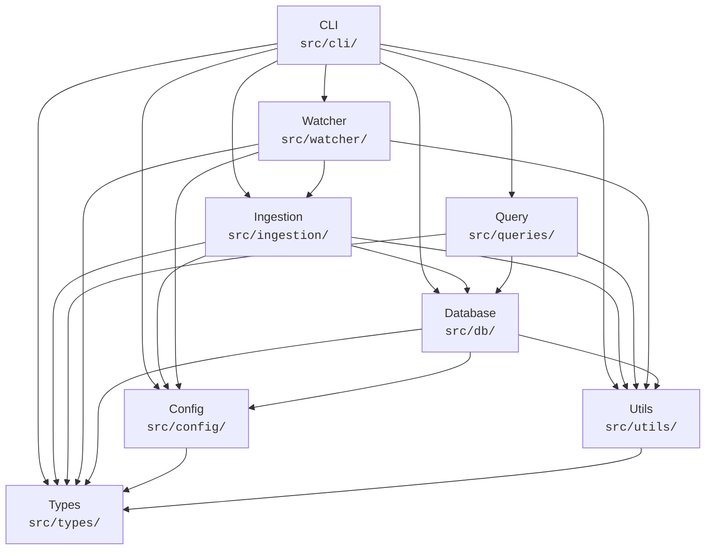

# 03 — Component Design

> Detailed specifications for every major module in ccanalytics.
> Each module follows the single responsibility principle and exposes
> a typed public interface consumed by other modules.
>
> Predecessor docs: `00-v0-analysis.md`, `01-c4-architecture.md`, `02-data-architecture.md`

---

## Table of Contents

1. [Module Dependency Graph](#1-module-dependency-graph)
2. [Module Initialization Order](#2-module-initialization-order)
3. [Module 1 — CLI (`src/cli/`)](#3-module-1--cli-srccli)
4. [Module 2 — Ingestion (`src/ingestion/`)](#4-module-2--ingestion-srcingestion)
5. [Module 3 — Query (`src/queries/`)](#5-module-3--query-srcqueries)
6. [Module 4 — Watcher (`src/watcher/`)](#6-module-4--watcher-srcwatcher)
7. [Module 5 — Database (`src/db/`)](#7-module-5--database-srcdb)
8. [Module 6 — Config (`src/config/`)](#8-module-6--config-srcconfig)
9. [Module 7 — Types (`src/types/`)](#9-module-7--types-srctypes)
10. [Module 8 — Utils (`src/utils/`)](#10-module-8--utils-srcutils)
11. [Cross-Cutting Concerns](#11-cross-cutting-concerns)
12. [Requirements Traceability](#12-requirements-traceability)

---

## 1. Module Dependency Graph

Arrows point from **dependent** to **dependency** (A --> B means "A imports from B").



**Key observations:**

- **Types** is a leaf node — it depends on nothing.
- **Config** depends only on Types.
- **Utils** depends only on Types.
- **Database** depends on Config, Types, and Utils.
- **Ingestion** and **Query** depend on Database but not on each other.
- **Watcher** depends on Ingestion (it triggers incremental ingestion).
- **CLI** is the composition root — it depends on everything.

---

## 2. Module Initialization Order

On startup the CLI entry point (`dist/cli.cjs`) executes the following
sequence. Each step must complete before the next begins.

```
1. Types          (compile-time only — no runtime init)
2. Config         loadConfig(overrides)
3. Utils          createLogger(config.verbose)
4. Database       ConnectionManager.connect(config.dbPath)
                  SchemaManager.ensureSchema(connection)
5. Ingestion      (lazy — created when `ingest` or `watch` commands run)
6. Query          (lazy — created when `query` or `dashboard` commands run)
7. Watcher        (lazy — created only when `watch` command runs)
8. CLI            Commander parses argv, dispatches to command handler
```

Shutdown is the reverse: Watcher.stop() --> ConnectionManager.close().

---

## 3. Module 1 — CLI (`src/cli/`)

### 3.1 Purpose

The CLI module is the **composition root** and **user-facing entry point**.
It parses command-line arguments via Commander v12, wires together all other
modules, and formats output for the terminal. It owns no business logic.

### 3.2 File Layout

```
src/cli/
  index.ts              # Commander program definition, global options
  commands/
    ingest.ts           # `claude-analytics ingest`
    query.ts            # `claude-analytics query`
    watch.ts            # `claude-analytics watch`
    dashboard.ts        # `claude-analytics dashboard`
    status.ts           # `claude-analytics status`
    export.ts           # `claude-analytics export`
```

### 3.3 Public Interface

```typescript
// src/cli/index.ts

import { Command } from "commander";

/** Global options available on every subcommand. */
export interface GlobalOptions {
  /** Path to DuckDB database file. Default: ~/.ccanalytics/analytics.duckdb */
  dbPath: string;
  /** Path to Claude data directory. Default: ~/.claude */
  claudeDir: string;
  /** Output format. Default: "table" */
  format: "table" | "json" | "csv";
  /** Enable verbose logging. Default: false */
  verbose: boolean;
}

/**
 * Build and return the configured Commander program.
 * Called from the CJS bin entry point.
 */
export function createProgram(): Command;

/**
 * Parse argv and execute the matched command.
 * Resolves when the command completes or rejects on fatal error.
 */
export function run(argv?: string[]): Promise<void>;
```

```typescript
// src/cli/commands/ingest.ts

import { Command } from "commander";

export interface IngestOptions {
  /** Glob pattern override for JSONL discovery. */
  glob?: string;
  /** Process only files modified after this ISO date. */
  since?: string;
  /** Maximum number of files to process in one run. */
  limit?: number;
  /** Force full re-ingestion, ignoring byte-offset state. */
  force: boolean;
  /** Dry-run mode — report files that would be ingested without writing. */
  dryRun: boolean;
}

/** Register the `ingest` subcommand on the parent program. */
export function registerIngestCommand(parent: Command): void;
```

```typescript
// src/cli/commands/query.ts

import { Command } from "commander";

export interface QueryOptions {
  /** Pre-built query template name. */
  template?: string;
  /** Raw SQL to execute (mutually exclusive with template). */
  sql?: string;
  /** Time range: "today", "7d", "30d", "all". Default: "7d" */
  range: string;
  /** Group-by dimension: "session", "day", "model", "tool". */
  groupBy?: string;
  /** Maximum rows to return. Default: 50 */
  limit: number;
}

export function registerQueryCommand(parent: Command): void;
```

```typescript
// src/cli/commands/watch.ts

import { Command } from "commander";

export interface WatchOptions {
  /** Polling interval in ms when native FS events are unavailable. Default: 2000 */
  pollInterval: number;
  /** Debounce delay in ms for change events. Default: 500 */
  debounce: number;
}

export function registerWatchCommand(parent: Command): void;
```

```typescript
// src/cli/commands/dashboard.ts

import { Command } from "commander";

export interface DashboardOptions {
  /** Time range for dashboard metrics. Default: "7d" */
  range: string;
  /** Auto-refresh interval in seconds. 0 = no refresh. Default: 0 */
  refresh: number;
}

export function registerDashboardCommand(parent: Command): void;
```

```typescript
// src/cli/commands/status.ts

import { Command } from "commander";

export interface StatusOptions {
  /** Show per-file ingestion state details. Default: false */
  detailed: boolean;
}

export function registerStatusCommand(parent: Command): void;
```

```typescript
// src/cli/commands/export.ts

import { Command } from "commander";

export interface ExportOptions {
  /** Export format. Default: "parquet" */
  format: "parquet" | "csv" | "json";
  /** Output directory or file path. Default: ./ccanalytics-export/ */
  output: string;
  /** Partition Parquet output by month. Default: true */
  partition: boolean;
  /** ZSTD compression for Parquet. Default: true */
  compress: boolean;
  /** Only export data older than this many days. */
  olderThan?: number;
}

export function registerExportCommand(parent: Command): void;
```

### 3.4 Dependencies

| Dependency | Purpose |
|------------|---------|
| `commander` (npm) | Command routing and argument parsing |
| `picocolors` (npm) | Terminal color output |
| `nanospinner` (npm) | Progress spinners during ingestion |
| `cli-table3` (npm) | Table rendering |
| Config | Load and merge configuration |
| Database | Obtain connection for commands |
| Ingestion | Execute ingestion pipeline |
| Query | Execute analytical queries |
| Watcher | Start/stop file watching |
| Utils | Output formatting, logging |
| Types | All shared type imports |

### 3.5 Error Handling

| Scenario | Behavior |
|----------|----------|
| Invalid subcommand | Commander auto-prints help and exits with code 1 |
| Missing required option | Commander prints error and exits with code 1 |
| Database connection failure | Log error with `Logger`, print user-friendly message, exit code 2 |
| Ingestion failure (partial) | Report files failed, continue with rest, exit code 3 on any failure |
| Query execution error | Print DuckDB error message, suggest `--verbose` for full stack, exit code 4 |
| Unhandled rejection | Global handler logs stack to verbose log, prints summary, exit code 1 |

### 3.6 Configuration

All global options can also be set via config file or environment variables.
Precedence: CLI flag > environment variable > config file > built-in default.

| Option | Env Var | Config Key | Default |
|--------|---------|------------|---------|
| `--db-path` | `CCANALYTICS_DB_PATH` | `dbPath` | `~/.ccanalytics/analytics.duckdb` |
| `--claude-dir` | `CCANALYTICS_CLAUDE_DIR` | `claudeDir` | `~/.claude` |
| `--format` | `CCANALYTICS_FORMAT` | `format` | `table` |
| `--verbose` | `CCANALYTICS_VERBOSE` | `verbose` | `false` |

---

## 4. Module 2 — Ingestion (`src/ingestion/`)

### 4.1 Purpose

The Ingestion module discovers JSONL session files, parses their contents
into typed records, deduplicates by `requestId`, and batch-inserts them into
DuckDB. It owns the **write path** — no other module writes to the analytical
tables.

### 4.2 File Layout

```
src/ingestion/
  index.ts              # Public API: orchestrates the full pipeline
  file-discovery.ts     # Glob-based JSONL file finder
  jsonl-parser.ts       # Streaming line parser with type discrimination
  deduplicator.ts       # requestId-based dedup (last entry wins)
  batch-inserter.ts     # DuckDB batch INSERT with transaction management
  ingestion-tracker.ts  # Byte-offset based incremental state
```

### 4.3 Public Interface

```typescript
// src/ingestion/index.ts

import type { IngestionConfig, IngestionResult, IngestionProgress } from "../types";

/** Orchestrates the full ingestion pipeline. */
export interface IngestionPipeline {
  /**
   * Run a full or incremental ingestion pass.
   * Returns a summary of what was ingested.
   */
  run(options?: { force?: boolean; limit?: number; since?: string }): Promise<IngestionResult>;

  /**
   * Subscribe to progress events during ingestion.
   * Useful for CLI progress display.
   */
  onProgress(callback: (progress: IngestionProgress) => void): void;
}

export function createIngestionPipeline(
  config: IngestionConfig,
  db: import("../db").ConnectionManager,
): IngestionPipeline;
```

```typescript
// src/ingestion/file-discovery.ts

/** A discovered JSONL file with metadata. */
export interface DiscoveredFile {
  /** Absolute path to the JSONL file. */
  absolutePath: string;
  /** Decoded project path (dashes -> slashes). */
  projectPath: string;
  /** Session ID extracted from filename. */
  sessionId: string;
  /** Whether this is a sub-agent file (agent-{shortId}.jsonl). */
  isSidechain: boolean;
  /** File size in bytes. */
  sizeBytes: number;
  /** Last modified timestamp. */
  modifiedAt: Date;
}

export interface FileDiscovery {
  /**
   * Discover all JSONL files under the Claude projects directory.
   * Respects glob overrides and since-date filtering.
   */
  discover(options?: {
    glob?: string;
    since?: string;
  }): Promise<DiscoveredFile[]>;
}

export function createFileDiscovery(claudeDir: string): FileDiscovery;
```

```typescript
// src/ingestion/jsonl-parser.ts

import type {
  RawJSONLEntry,
  UserMessage,
  AssistantMessage,
  FileHistorySnapshot,
  QueueOperation,
} from "../types";

/** Discriminated union of all parsed JSONL entry types. */
export type ParsedEntry =
  | { type: "user"; data: UserMessage }
  | { type: "assistant"; data: AssistantMessage }
  | { type: "file-history-snapshot"; data: FileHistorySnapshot }
  | { type: "queue-operation"; data: QueueOperation };

/** Result of parsing a single JSONL file. */
export interface ParseResult {
  entries: ParsedEntry[];
  /** Number of lines that failed to parse. */
  parseErrors: number;
  /** Total bytes read. */
  bytesRead: number;
  /** Total lines processed (including errors). */
  linesProcessed: number;
}

export interface JSONLParser {
  /**
   * Parse a JSONL file from a given byte offset.
   * Returns typed entries and the new byte offset.
   */
  parseFile(
    filePath: string,
    fromByteOffset?: number,
  ): Promise<ParseResult>;

  /**
   * Parse a single JSONL line into a typed entry.
   * Returns null if the line cannot be parsed.
   */
  parseLine(line: string): ParsedEntry | null;
}

export function createJSONLParser(): JSONLParser;
```

```typescript
// src/ingestion/deduplicator.ts

import type { AssistantMessage } from "../types";

export interface DeduplicationResult {
  /** Deduplicated assistant messages (last entry per requestId wins). */
  unique: AssistantMessage[];
  /** Number of duplicate entries removed. */
  duplicatesRemoved: number;
}

export interface Deduplicator {
  /**
   * Deduplicate assistant messages by requestId.
   * Last entry wins — the final entry for a given requestId is authoritative.
   */
  deduplicate(messages: AssistantMessage[]): DeduplicationResult;
}

export function createDeduplicator(): Deduplicator;
```

```typescript
// src/ingestion/batch-inserter.ts

import type {
  SessionRow,
  ConversationTurnRow,
  ToolCallRow,
  ErrorRow,
} from "../types";

/** Batch of rows ready for insertion across all tables. */
export interface InsertionBatch {
  sessions: SessionRow[];
  conversationTurns: ConversationTurnRow[];
  toolCalls: ToolCallRow[];
  errors: ErrorRow[];
}

export interface InsertionResult {
  sessionsUpserted: number;
  turnsInserted: number;
  toolCallsInserted: number;
  errorsInserted: number;
  durationMs: number;
}

export interface BatchInserter {
  /**
   * Insert a batch of rows into DuckDB within a single transaction.
   * Uses MERGE INTO for idempotent upserts on sessions.
   */
  insert(batch: InsertionBatch): Promise<InsertionResult>;

  /**
   * Set the maximum batch size before flushing. Default: 1000.
   */
  setBatchSize(size: number): void;
}

export function createBatchInserter(
  db: import("../db").ConnectionManager,
): BatchInserter;
```

```typescript
// src/ingestion/ingestion-tracker.ts

import type { IngestionState } from "../types";

export interface IngestionTracker {
  /**
   * Get the last ingestion state for a file.
   * Returns null if the file has never been ingested.
   */
  getState(filePath: string): Promise<IngestionState | null>;

  /**
   * Update the ingestion state for a file after a successful pass.
   */
  updateState(filePath: string, state: IngestionState): Promise<void>;

  /**
   * Get all tracked file states. Useful for status reporting.
   */
  getAllStates(): Promise<Map<string, IngestionState>>;

  /**
   * Reset state for a file (used with --force flag).
   */
  resetState(filePath: string): Promise<void>;

  /**
   * Reset state for all files.
   */
  resetAll(): Promise<void>;
}

export function createIngestionTracker(
  db: import("../db").ConnectionManager,
): IngestionTracker;
```

### 4.4 Dependencies

| Dependency | Purpose |
|------------|---------|
| `node:fs/promises` | File reading |
| `node:readline` | Streaming line-by-line parsing |
| `glob` (npm) or `node:fs` globbing | JSONL file discovery |
| Database (`ConnectionManager`) | Write access to DuckDB |
| Utils (`Logger`, `Paths`) | Logging, path encoding/decoding |
| Types | All shared row and message types |
| Config (`IngestionConfig`) | Batch size, claude dir path |

### 4.5 Error Handling

| Scenario | Behavior |
|----------|----------|
| Malformed JSONL line | Skip line, increment `parseErrors`, log at verbose level |
| Missing required field on entry | Skip entry, log warning with file path and line number |
| File read permission error | Skip file, report in `IngestionResult.failedFiles`, continue with other files |
| File deleted mid-read | Catch `ENOENT`, skip file, log warning |
| DuckDB write failure | Roll back transaction, report error, re-throw for caller to decide retry |
| Batch too large for memory | Flush at `batchSize` threshold; default 1000 rows per flush |
| Byte-offset mismatch (file truncated/rotated) | Reset offset to 0, re-ingest full file, log warning |

### 4.6 Configuration

```typescript
// Subset of CCAnalyticsConfig relevant to ingestion
export interface IngestionConfig {
  /** Path to Claude data directory. */
  claudeDir: string;
  /** Glob pattern for JSONL discovery. Default: "projects/** /*.jsonl" */
  globPattern: string;
  /** Max rows per INSERT batch. Default: 1000 */
  batchSize: number;
  /** Skip files smaller than N bytes. Default: 0 */
  minFileSize: number;
  /** Skip files not modified in the last N days. Default: 30 */
  maxAgeDays: number;
}
```

---

## 5. Module 3 — Query (`src/queries/`)

### 5.1 Purpose

The Query module contains **read-only analytical query builders** that
execute against the DuckDB star schema. Each analyzer encapsulates a family
of related analytical questions and returns strongly typed result objects.

### 5.2 File Layout

```
src/queries/
  index.ts              # Re-exports all analyzers
  session-analyzer.ts   # Session summaries, duration, turn counts
  cost-analyzer.ts      # Cost breakdowns by model, day, session, project
  cache-analyzer.ts     # Cache hit rate calculations and trending
  tool-analyzer.ts      # Tool usage patterns, success rates, chains
  timeseries-analyzer.ts # Hourly/daily/weekly aggregations
```

### 5.3 Public Interface

```typescript
// src/queries/index.ts

export { SessionAnalyzer, createSessionAnalyzer } from "./session-analyzer";
export { CostAnalyzer, createCostAnalyzer } from "./cost-analyzer";
export { CacheAnalyzer, createCacheAnalyzer } from "./cache-analyzer";
export { ToolAnalyzer, createToolAnalyzer } from "./tool-analyzer";
export { TimeSeriesAnalyzer, createTimeSeriesAnalyzer } from "./timeseries-analyzer";
```

```typescript
// src/queries/session-analyzer.ts

import type {
  SessionSummary,
  SessionDetail,
  TimeRange,
  SortOrder,
} from "../types";

export interface SessionAnalyzer {
  /** Get paginated session summaries within a time range. */
  listSessions(options: {
    range: TimeRange;
    sortBy?: "start_time" | "cost" | "turns" | "duration";
    order?: SortOrder;
    limit?: number;
    offset?: number;
  }): Promise<SessionSummary[]>;

  /** Get full detail for a single session including all turns. */
  getSession(sessionId: string): Promise<SessionDetail | null>;

  /** Get aggregate statistics across all sessions in a time range. */
  getAggregateStats(range: TimeRange): Promise<SessionAggregateStats>;

  /** Get the distribution of session durations as histogram buckets. */
  getDurationDistribution(range: TimeRange): Promise<HistogramBucket[]>;

  /** Get conversation depth (turns per session) distribution. */
  getDepthDistribution(range: TimeRange): Promise<HistogramBucket[]>;
}

export interface SessionAggregateStats {
  totalSessions: number;
  totalTurns: number;
  avgTurnsPerSession: number;
  avgDurationMinutes: number;
  medianDurationMinutes: number;
  totalCostUSD: number;
  avgCostPerSession: number;
  uniqueModels: string[];
}

export interface HistogramBucket {
  /** Lower bound of the bucket (inclusive). */
  min: number;
  /** Upper bound of the bucket (exclusive). */
  max: number;
  /** Count of sessions in this bucket. */
  count: number;
}

export function createSessionAnalyzer(
  db: import("../db").QueryExecutor,
): SessionAnalyzer;
```

```typescript
// src/queries/cost-analyzer.ts

import type {
  CostBreakdown,
  CostTrend,
  ModelCostBreakdown,
  TimeRange,
  TimeBucket,
} from "../types";

export interface CostAnalyzer {
  /** Get total cost breakdown (input, output, cache_write, cache_read). */
  getTotalCost(range: TimeRange): Promise<CostBreakdown>;

  /** Get cost broken down by model. */
  getCostByModel(range: TimeRange): Promise<ModelCostBreakdown[]>;

  /** Get cost broken down by project (decoded from file paths). */
  getCostByProject(range: TimeRange): Promise<ProjectCostBreakdown[]>;

  /** Get cost trending over time at the specified granularity. */
  getCostTrend(range: TimeRange, bucket: TimeBucket): Promise<CostTrend[]>;

  /** Get the top N most expensive sessions. */
  getExpensiveSessions(range: TimeRange, limit?: number): Promise<SessionCostSummary[]>;

  /**
   * Cross-validate JSONL costUSD against computed cost using model pricing.
   * Returns discrepancies exceeding the threshold (default 1%).
   */
  crossValidateCosts(range: TimeRange, thresholdPct?: number): Promise<CostDiscrepancy[]>;
}

export interface ProjectCostBreakdown {
  projectPath: string;
  totalCostUSD: number;
  sessionCount: number;
  tokenBreakdown: CostBreakdown;
}

export interface SessionCostSummary {
  sessionId: string;
  startTime: Date;
  totalCostUSD: number;
  model: string;
  numTurns: number;
}

export interface CostDiscrepancy {
  sessionId: string;
  turnId: string;
  reportedCostUSD: number;
  computedCostUSD: number;
  discrepancyPct: number;
}

export function createCostAnalyzer(
  db: import("../db").QueryExecutor,
): CostAnalyzer;
```

```typescript
// src/queries/cache-analyzer.ts

import type {
  CacheMetrics,
  CacheEfficiencyTrend,
  TimeRange,
  TimeBucket,
} from "../types";

export interface CacheAnalyzer {
  /**
   * Get overall cache metrics for a time range.
   * Implements: cache_hit_rate = cache_read / (cache_read + cache_write + uncached_input)
   */
  getCacheMetrics(range: TimeRange): Promise<CacheMetrics>;

  /** Get cache efficiency trending over time. */
  getCacheEfficiencyTrend(
    range: TimeRange,
    bucket: TimeBucket,
  ): Promise<CacheEfficiencyTrend[]>;

  /** Get cache metrics broken down by session. */
  getCacheBySession(range: TimeRange): Promise<SessionCacheMetrics[]>;

  /** Get cache metrics broken down by model. */
  getCacheByModel(range: TimeRange): Promise<ModelCacheMetrics[]>;
}

export interface SessionCacheMetrics {
  sessionId: string;
  cacheHitRate: number;
  cacheReadTokens: number;
  cacheWriteTokens: number;
  uncachedInputTokens: number;
  estimatedSavingsUSD: number;
}

export interface ModelCacheMetrics {
  model: string;
  cacheHitRate: number;
  cacheReadTokens: number;
  cacheWriteTokens: number;
  uncachedInputTokens: number;
}

export function createCacheAnalyzer(
  db: import("../db").QueryExecutor,
): CacheAnalyzer;
```

```typescript
// src/queries/tool-analyzer.ts

import type { ToolUsageStats, TimeRange } from "../types";

export interface ToolAnalyzer {
  /** Get usage stats for all tools in a time range. */
  getToolUsage(range: TimeRange): Promise<ToolUsageStats[]>;

  /** Get success/failure rates per tool. */
  getToolSuccessRates(range: TimeRange): Promise<ToolSuccessRate[]>;

  /**
   * Detect common tool call chains (e.g., Read -> Edit -> Bash).
   * Uses window functions to find sequential patterns within sessions.
   */
  getToolChains(range: TimeRange, minOccurrences?: number): Promise<ToolChain[]>;

  /**
   * Get MCP server-level aggregation.
   * Parses `mcp__<server>__<tool>` naming convention.
   */
  getMCPServerUsage(range: TimeRange): Promise<MCPServerUsage[]>;

  /** Get per-tool token cost attribution. */
  getToolTokenCost(range: TimeRange): Promise<ToolTokenCost[]>;
}

export interface ToolSuccessRate {
  toolName: string;
  totalCalls: number;
  successCount: number;
  failureCount: number;
  successRate: number;
  avgDurationMs: number;
  commonErrors: string[];
}

export interface ToolChain {
  /** Ordered sequence of tool names. */
  chain: string[];
  /** Number of times this chain appeared. */
  occurrences: number;
  /** Average total duration of the chain in ms. */
  avgDurationMs: number;
}

export interface MCPServerUsage {
  serverName: string;
  totalCalls: number;
  uniqueTools: string[];
  totalTokens: number;
  avgDurationMs: number;
}

export interface ToolTokenCost {
  toolName: string;
  totalInputTokens: number;
  totalOutputTokens: number;
  estimatedCostUSD: number;
  callCount: number;
}

export function createToolAnalyzer(
  db: import("../db").QueryExecutor,
): ToolAnalyzer;
```

```typescript
// src/queries/timeseries-analyzer.ts

import type { TimeRange, TimeBucket } from "../types";

export interface TimeSeriesAnalyzer {
  /** Get token usage aggregated into time buckets. */
  getTokenUsageSeries(
    range: TimeRange,
    bucket: TimeBucket,
  ): Promise<TokenUsagePoint[]>;

  /** Get session count per time bucket. */
  getSessionCountSeries(
    range: TimeRange,
    bucket: TimeBucket,
  ): Promise<TimeSeriesPoint[]>;

  /** Get tool call count per time bucket. */
  getToolCallSeries(
    range: TimeRange,
    bucket: TimeBucket,
  ): Promise<TimeSeriesPoint[]>;

  /** Get activity heatmap (hour-of-day vs day-of-week). */
  getActivityHeatmap(range: TimeRange): Promise<HeatmapCell[]>;

  /** Get model usage distribution over time. */
  getModelUsageSeries(
    range: TimeRange,
    bucket: TimeBucket,
  ): Promise<ModelUsagePoint[]>;
}

export interface TimeSeriesPoint {
  timestamp: Date;
  value: number;
}

export interface TokenUsagePoint {
  timestamp: Date;
  inputTokens: number;
  outputTokens: number;
  cacheReadTokens: number;
  cacheWriteTokens: number;
  totalCostUSD: number;
}

export interface HeatmapCell {
  dayOfWeek: number;   // 0 = Sunday
  hourOfDay: number;   // 0-23
  value: number;       // count of sessions or turns
}

export interface ModelUsagePoint {
  timestamp: Date;
  model: string;
  sessionCount: number;
  totalTokens: number;
  totalCostUSD: number;
}

export function createTimeSeriesAnalyzer(
  db: import("../db").QueryExecutor,
): TimeSeriesAnalyzer;
```

### 5.4 Dependencies

| Dependency | Purpose |
|------------|---------|
| Database (`QueryExecutor`) | Parameterized SQL execution |
| Utils (`Logger`) | Verbose query logging |
| Types | All result types, `TimeRange`, `TimeBucket` |

### 5.5 Error Handling

| Scenario | Behavior |
|----------|----------|
| Empty result set | Return empty array or zero-valued aggregate — never null |
| Invalid time range (end < start) | Throw `QueryValidationError` with descriptive message |
| DuckDB SQL error | Wrap in `QueryExecutionError` with original SQL for debugging |
| Schema mismatch (table missing) | Throw `SchemaError` suggesting re-run of `ingest` command |
| Timeout on long query | DuckDB does not natively timeout; rely on Node.js-level AbortSignal if needed |

### 5.6 Configuration

Query analyzers are stateless — they require no persistent configuration
beyond the `QueryExecutor` dependency. Time ranges and buckets are passed
per call.

---

## 6. Module 4 — Watcher (`src/watcher/`)

### 6.1 Purpose

The Watcher module provides real-time file system monitoring for JSONL
session files. When changes are detected, it triggers incremental ingestion
of only the new bytes appended since the last read. It uses Chokidar v5 for
cross-platform compatibility and `awaitWriteFinish` to handle partial writes.

### 6.2 File Layout

```
src/watcher/
  index.ts              # Public API
  chokidar-manager.ts   # Chokidar instance lifecycle
  change-processor.ts   # Debounced change event handling
  incremental-ingester.ts # Byte-offset based incremental reads
```

### 6.3 Public Interface

```typescript
// src/watcher/index.ts

import type { WatcherConfig, WatcherStatus, WatchEvent } from "../types";

export interface Watcher {
  /** Start watching for JSONL file changes. */
  start(): Promise<void>;

  /** Stop watching and clean up resources. */
  stop(): Promise<void>;

  /** Get current watcher status (running, file count, last event). */
  getStatus(): WatcherStatus;

  /** Subscribe to watch events for logging/display. */
  onEvent(callback: (event: WatchEvent) => void): void;
}

export function createWatcher(
  config: WatcherConfig,
  ingestionPipeline: import("../ingestion").IngestionPipeline,
): Watcher;
```

```typescript
// src/watcher/chokidar-manager.ts

export interface ChokidarManagerOptions {
  /** Glob patterns to watch. */
  patterns: string[];
  /** awaitWriteFinish stabilityThreshold in ms. Default: 2000 */
  stabilityThreshold: number;
  /** Polling interval when native events unavailable. Default: 2000 */
  pollInterval: number;
  /** Use polling instead of native events. Default: false */
  usePolling: boolean;
}

export interface ChokidarManager {
  /** Initialize the Chokidar watcher with configured options. */
  initialize(options: ChokidarManagerOptions): Promise<void>;

  /** Register a callback for file add/change events. */
  onFileChange(callback: (filePath: string, stats: import("fs").Stats) => void): void;

  /** Close the Chokidar watcher and release resources. */
  close(): Promise<void>;

  /** Get the number of files currently being watched. */
  getWatchedCount(): number;
}

export function createChokidarManager(): ChokidarManager;
```

```typescript
// src/watcher/change-processor.ts

export interface ChangeProcessorOptions {
  /** Debounce delay in ms. Events within this window are batched. Default: 500 */
  debounceMs: number;
  /** Maximum number of files to process in a single batch. Default: 50 */
  maxBatchSize: number;
}

export interface ChangeProcessor {
  /** Queue a file change for processing. Debounces internally. */
  enqueue(filePath: string): void;

  /** Register handler called when the debounced batch is ready. */
  onBatch(callback: (filePaths: string[]) => Promise<void>): void;

  /** Flush any pending changes immediately. */
  flush(): Promise<void>;

  /** Get count of pending (not yet flushed) changes. */
  getPendingCount(): number;
}

export function createChangeProcessor(
  options?: Partial<ChangeProcessorOptions>,
): ChangeProcessor;
```

```typescript
// src/watcher/incremental-ingester.ts

import type { IngestionState } from "../types";

export interface IncrementalIngester {
  /**
   * Ingest only the new bytes from a file since the last tracked offset.
   * Returns the new ingestion state to persist.
   */
  ingestIncremental(
    filePath: string,
    previousState: IngestionState | null,
  ): Promise<IncrementalResult>;
}

export interface IncrementalResult {
  newState: IngestionState;
  entriesParsed: number;
  bytesRead: number;
  parseErrors: number;
}

export function createIncrementalIngester(
  parser: import("../ingestion/jsonl-parser").JSONLParser,
  inserter: import("../ingestion/batch-inserter").BatchInserter,
  tracker: import("../ingestion/ingestion-tracker").IngestionTracker,
): IncrementalIngester;
```

### 6.4 Dependencies

| Dependency | Purpose |
|------------|---------|
| `chokidar` (npm) | Cross-platform file system watching |
| Ingestion (`JSONLParser`, `BatchInserter`, `IngestionTracker`) | Parsing and writing new data |
| Utils (`Logger`) | Event logging |
| Types | `WatcherConfig`, `WatchEvent`, `IngestionState` |
| Config | Watcher-specific configuration |

### 6.5 Error Handling

| Scenario | Behavior |
|----------|----------|
| Chokidar initialization failure | Throw `WatcherError` — usually a permissions issue |
| Watched directory deleted | Log warning, continue watching (Chokidar handles re-creation) |
| File change during read | `awaitWriteFinish` with 2-second stability threshold prevents this |
| Ingestion error on single file | Log error, skip file, continue watching other files |
| Too many open files (EMFILE) | Reduce watched scope, suggest `--poll-interval` flag |
| Process shutdown (SIGINT/SIGTERM) | `stop()` called by CLI shutdown handler; flushes pending changes |

### 6.6 Configuration

```typescript
export interface WatcherConfig {
  /** Glob patterns to watch. Default: ["~/.claude/projects/** /*.jsonl"] */
  patterns: string[];
  /** awaitWriteFinish stability threshold in ms. Default: 2000 */
  stabilityThreshold: number;
  /** Debounce delay for change events in ms. Default: 500 */
  debounceMs: number;
  /** Polling interval in ms (fallback mode). Default: 2000 */
  pollInterval: number;
  /** Use polling instead of native FS events. Default: false */
  usePolling: boolean;
  /** Max files per ingestion batch. Default: 50 */
  maxBatchSize: number;
}
```

---

## 7. Module 5 — Database (`src/db/`)

### 7.1 Purpose

The Database module manages the DuckDB connection lifecycle, schema creation
and migration, and parameterized query execution. It is the **sole owner**
of the DuckDB connection — all other modules access the database through
this module's interfaces.

### 7.2 File Layout

```
src/db/
  index.ts              # Re-exports public API
  connection-manager.ts # DuckDB connection lifecycle
  schema-manager.ts     # Table/view/index creation and migration
  query-executor.ts     # Parameterized query execution with result mapping
```

### 7.3 Public Interface

```typescript
// src/db/connection-manager.ts

import type { DuckDBInstance, DuckDBConnection } from "@duckdb/node-api";

export interface ConnectionManager {
  /**
   * Open a DuckDB instance and connection.
   * Creates the database file and parent directories if they do not exist.
   */
  connect(dbPath: string): Promise<void>;

  /** Get the active connection. Throws if not connected. */
  getConnection(): DuckDBConnection;

  /** Get the active instance. Throws if not connected. */
  getInstance(): DuckDBInstance;

  /** Whether a connection is currently open. */
  isConnected(): boolean;

  /**
   * Close the connection and instance.
   * Safe to call multiple times.
   */
  close(): Promise<void>;
}

export function createConnectionManager(): ConnectionManager;
```

```typescript
// src/db/schema-manager.ts

export interface SchemaVersion {
  version: number;
  appliedAt: Date;
  description: string;
}

export interface SchemaManager {
  /**
   * Ensure all required tables, views, and indexes exist.
   * Runs migrations in order from current version to latest.
   */
  ensureSchema(connection: import("@duckdb/node-api").DuckDBConnection): Promise<void>;

  /** Get the current schema version. Returns 0 if no schema exists. */
  getCurrentVersion(
    connection: import("@duckdb/node-api").DuckDBConnection,
  ): Promise<number>;

  /** Get the full migration history. */
  getMigrationHistory(
    connection: import("@duckdb/node-api").DuckDBConnection,
  ): Promise<SchemaVersion[]>;
}

export function createSchemaManager(): SchemaManager;
```

Schema managed by `SchemaManager.ensureSchema()`:

```sql
-- Tables: sessions, conversation_turns, tool_calls, errors, ingestion_state
-- See 02-data-architecture.md for full DDL.
-- Additionally:

CREATE TABLE IF NOT EXISTS schema_migrations (
  version   INTEGER PRIMARY KEY,
  applied_at TIMESTAMP DEFAULT current_timestamp,
  description VARCHAR
);

-- Indexes for common query patterns
CREATE INDEX IF NOT EXISTS idx_sessions_start ON sessions(start_time);
CREATE INDEX IF NOT EXISTS idx_turns_session  ON conversation_turns(session_id);
CREATE INDEX IF NOT EXISTS idx_turns_ts       ON conversation_turns(timestamp);
CREATE INDEX IF NOT EXISTS idx_tools_session  ON tool_calls(session_id);
CREATE INDEX IF NOT EXISTS idx_tools_name     ON tool_calls(tool_name);
CREATE INDEX IF NOT EXISTS idx_errors_session ON errors(session_id);

-- Views for common analytics
CREATE OR REPLACE VIEW v_session_summary AS
  SELECT
    s.session_id,
    s.start_time,
    s.end_time,
    s.duration,
    s.model,
    s.total_cost,
    s.num_turns,
    s.num_tool_calls,
    s.total_cache_read_tokens::DOUBLE
      / NULLIF(s.total_cache_read_tokens + s.total_cache_write_tokens
               + s.total_input_tokens, 0) AS cache_hit_rate
  FROM sessions s;

CREATE OR REPLACE VIEW v_daily_cost AS
  SELECT
    date_trunc('day', start_time) AS day,
    model,
    COUNT(*) AS session_count,
    SUM(total_cost) AS total_cost,
    SUM(total_input_tokens) AS total_input,
    SUM(total_output_tokens) AS total_output
  FROM sessions
  GROUP BY ROLLUP(day, model);
```

```typescript
// src/db/query-executor.ts

export interface QueryResult<T = Record<string, unknown>> {
  rows: T[];
  rowCount: number;
  columnNames: string[];
  durationMs: number;
}

export interface QueryExecutor {
  /**
   * Execute a parameterized SQL query and return typed results.
   * Uses DuckDB prepared statements to prevent SQL injection.
   */
  execute<T = Record<string, unknown>>(
    sql: string,
    params?: unknown[],
  ): Promise<QueryResult<T>>;

  /**
   * Execute a SQL statement that returns no results (DDL, INSERT, UPDATE).
   */
  run(sql: string, params?: unknown[]): Promise<void>;

  /**
   * Execute multiple statements within a transaction.
   * Rolls back on any error.
   */
  transaction<T>(fn: (executor: QueryExecutor) => Promise<T>): Promise<T>;
}

export function createQueryExecutor(
  connection: import("@duckdb/node-api").DuckDBConnection,
): QueryExecutor;
```

### 7.4 Dependencies

| Dependency | Purpose |
|------------|---------|
| `@duckdb/node-api` (npm) | DuckDB v1.4+ Promise-native binding |
| `node:fs/promises` | Ensure database directory exists |
| Config (`dbPath`) | Database file location |
| Utils (`Logger`) | Query logging in verbose mode |
| Types | `IngestionState` and row types for schema |

### 7.5 Error Handling

| Scenario | Behavior |
|----------|----------|
| Database file locked (single-writer) | Throw `DatabaseLockedError` with PID hint if available |
| Database file corrupted | Throw `DatabaseCorruptError`, suggest backup restore |
| Connection lost mid-query | Throw `ConnectionError`, auto-reconnect on next call |
| Migration failure | Roll back failed migration, throw `MigrationError` with version number |
| Query syntax error | Throw `QuerySyntaxError` wrapping DuckDB native error |
| Transaction deadlock | DuckDB is single-writer, so true deadlocks cannot occur; timeout after 30s |
| Disk full | Let DuckDB native error propagate, wrapped in `DatabaseError` |

### 7.6 Configuration

```typescript
export interface DatabaseConfig {
  /** Path to the DuckDB database file. Default: ~/.ccanalytics/analytics.duckdb */
  dbPath: string;
  /** Whether to log all SQL queries (verbose mode). Default: false */
  logQueries: boolean;
  /** Memory limit for DuckDB. Default: "256MB" */
  memoryLimit: string;
  /** Number of threads for DuckDB. Default: system cores / 2 */
  threads: number;
}
```

---

## 8. Module 6 — Config (`src/config/`)

### 8.1 Purpose

The Config module discovers, loads, validates, and merges configuration from
multiple sources. It implements the precedence chain:
CLI flags > environment variables > config file > built-in defaults.

### 8.2 File Layout

```
src/config/
  index.ts              # Public API
  config-loader.ts      # File discovery and multi-source merging
  defaults.ts           # Built-in default values
  validation.ts         # Schema validation
```

### 8.3 Public Interface

```typescript
// src/config/index.ts

import type { CCAnalyticsConfig } from "../types";

export { loadConfig } from "./config-loader";
export { DEFAULTS } from "./defaults";
export { validateConfig } from "./validation";
```

```typescript
// src/config/config-loader.ts

import type { CCAnalyticsConfig } from "../types";

export interface ConfigSources {
  /** Overrides from CLI flags (highest precedence). */
  cliOverrides?: Partial<CCAnalyticsConfig>;
  /** Explicit path to config file. Skips discovery if provided. */
  configPath?: string;
}

/**
 * Load configuration by merging all sources.
 * Precedence: CLI flags > env vars > config file > defaults.
 *
 * Config file locations searched (in order):
 *   1. Explicit --config path
 *   2. .ccanalyticsrc.json in current directory
 *   3. ~/.ccanalytics/config.json
 *   4. ~/.config/ccanalytics/config.json
 */
export function loadConfig(sources?: ConfigSources): Promise<CCAnalyticsConfig>;

/**
 * Resolve the Claude data directory, checking both legacy and modern paths.
 * Returns the first directory that exists:
 *   1. Explicit claudeDir from config
 *   2. ~/.claude
 *   3. ~/.config/claude
 */
export function resolveClaudeDir(explicit?: string): Promise<string>;
```

```typescript
// src/config/defaults.ts

import type { CCAnalyticsConfig } from "../types";

/** Built-in defaults for all configuration options. */
export const DEFAULTS: Readonly<CCAnalyticsConfig>;

// The actual default values:
// {
//   dbPath: "~/.ccanalytics/analytics.duckdb",
//   claudeDir: "~/.claude",
//   format: "table",
//   verbose: false,
//   ingestion: {
//     globPattern: "projects/**/*.jsonl",
//     batchSize: 1000,
//     minFileSize: 0,
//     maxAgeDays: 30,
//   },
//   watcher: {
//     patterns: ["~/.claude/projects/**/*.jsonl"],
//     stabilityThreshold: 2000,
//     debounceMs: 500,
//     pollInterval: 2000,
//     usePolling: false,
//     maxBatchSize: 50,
//   },
//   database: {
//     logQueries: false,
//     memoryLimit: "256MB",
//     threads: 0,     // 0 = DuckDB auto-detect
//   },
// }
```

```typescript
// src/config/validation.ts

import type { CCAnalyticsConfig } from "../types";

export interface ValidationResult {
  valid: boolean;
  errors: ValidationError[];
}

export interface ValidationError {
  path: string;       // e.g., "ingestion.batchSize"
  message: string;    // e.g., "Must be a positive integer"
  value: unknown;     // The invalid value
}

/**
 * Validate a config object against the schema.
 * Returns a result object rather than throwing, so callers can
 * collect all errors before reporting.
 */
export function validateConfig(
  config: Partial<CCAnalyticsConfig>,
): ValidationResult;
```

### 8.4 Dependencies

| Dependency | Purpose |
|------------|---------|
| `node:fs/promises` | Read config files |
| `node:path` | Resolve config file paths |
| `node:os` | Home directory resolution (`~` expansion) |
| Types | `CCAnalyticsConfig` and nested config types |

### 8.5 Error Handling

| Scenario | Behavior |
|----------|----------|
| Config file not found | Silently fall back to defaults (config file is optional) |
| Config file malformed JSON | Throw `ConfigParseError` with file path and JSON parse error |
| Validation failure | Return `ValidationResult` with all errors; caller decides severity |
| Environment variable invalid type | Log warning, fall back to default for that key |
| Home directory unresolvable | Throw `ConfigError` — likely a broken environment |

### 8.6 Configuration

The Config module itself has no configuration — it *is* the source of
configuration for everything else. The only input is the optional
`ConfigSources` argument to `loadConfig()`.

---

## 9. Module 7 — Types (`src/types/`)

### 9.1 Purpose

The Types module is the **single source of truth** for all TypeScript types
shared across the codebase. It contains no runtime code — only type
definitions, interfaces, and enums. Every other module imports from here.

### 9.2 File Layout

```
src/types/
  index.ts              # Barrel re-export of all types
  jsonl.ts              # JSONL message types
  database.ts           # Database row types
  analytics.ts          # Analytics result types
  config.ts             # Configuration types
  common.ts             # Shared primitives (TimeRange, TimeBucket, etc.)
```

### 9.3 Public Interface

```typescript
// src/types/common.ts

/** Inclusive start, exclusive end time range. */
export interface TimeRange {
  start: Date;
  end: Date;
}

export type TimeBucket = "hour" | "day" | "week" | "month";

export type OutputFormat = "table" | "json" | "csv";

export type SortOrder = "asc" | "desc";

/** Progress report emitted during long-running operations. */
export interface IngestionProgress {
  phase: "discovery" | "parsing" | "dedup" | "inserting";
  filesTotal: number;
  filesProcessed: number;
  entriesTotal: number;
  entriesProcessed: number;
  bytesTotal: number;
  bytesProcessed: number;
  currentFile?: string;
}

/** Result of a complete ingestion run. */
export interface IngestionResult {
  filesDiscovered: number;
  filesProcessed: number;
  filesSkipped: number;
  filesFailed: number;
  failedFiles: Array<{ path: string; error: string }>;
  entriesIngested: number;
  duplicatesRemoved: number;
  parseErrors: number;
  durationMs: number;
}
```

```typescript
// src/types/jsonl.ts

// -- Content Blocks --

export interface ThinkingBlock {
  type: "thinking";
  thinking: string;
  signature: string;
}

export interface ToolUseBlock {
  type: "tool_use";
  id: string;
  name: string;
  input: Record<string, unknown>;
}

export interface TextBlock {
  type: "text";
  text: string;
}

export interface ToolResultBlock {
  type: "tool_result";
  tool_use_id: string;
  content: string | Array<{ type: string; text?: string }>;
  is_error?: boolean;
}

export type ContentBlock = ThinkingBlock | ToolUseBlock | TextBlock | ToolResultBlock;

// -- Token Usage --

export interface TokenUsage {
  input_tokens: number;
  output_tokens: number;
  cache_creation_input_tokens: number;
  cache_read_input_tokens: number;
}

// -- Message Types --

export interface UserMessage {
  type: "user";
  sessionId: string;
  timestamp: string;
  message: {
    role: "user";
    content: ContentBlock[];
  };
  parentUuid?: string;
  uuid?: string;
}

export interface AssistantMessage {
  type: "assistant";
  sessionId: string;
  timestamp: string;
  costUSD: number;
  usage: TokenUsage;
  requestId: string;
  parentUuid?: string;
  uuid?: string;
  version?: string;
  gitBranch?: string;
  model?: string;
  message: {
    role: "assistant";
    content: ContentBlock[];
    stop_reason?: string;
    model?: string;
  };
}

export interface FileHistorySnapshot {
  type: "file-history-snapshot";
  sessionId: string;
  timestamp: string;
  files: Record<string, unknown>;
}

export interface QueueOperation {
  type: "queue-operation";
  sessionId: string;
  timestamp: string;
  operation: string;
  data?: Record<string, unknown>;
}

/** Raw JSONL entry before type discrimination. */
export interface RawJSONLEntry {
  type: string;
  sessionId?: string;
  timestamp?: string;
  [key: string]: unknown;
}
```

```typescript
// src/types/database.ts

// -- Row types matching the star schema --

export interface SessionRow {
  session_id: string;
  start_time: Date;
  end_time: Date;
  duration_ms: number;
  model: string;
  total_input_tokens: number;
  total_output_tokens: number;
  total_cache_write_tokens: number;
  total_cache_read_tokens: number;
  total_cost: number;
  num_turns: number;
  num_tool_calls: number;
  cwd: string;
  source_file: string;
}

export interface ConversationTurnRow {
  turn_id: string;
  session_id: string;
  role: string;
  timestamp: Date;
  input_tokens: number;
  output_tokens: number;
  cache_write_tokens: number;
  cache_read_tokens: number;
  cost: number;
  model: string;
  stop_reason: string | null;
  request_id: string;
}

export interface ToolCallRow {
  tool_call_id: string;
  session_id: string;
  turn_id: string;
  tool_name: string;
  duration_ms: number | null;
  success: boolean;
  error_message: string | null;
  parameters: Record<string, unknown> | null;
}

export interface ErrorRow {
  error_id: string;
  session_id: string;
  timestamp: Date;
  error_type: string;
  message: string;
  is_retryable: boolean;
  retry_count: number;
}

export interface IngestionState {
  file_path: string;
  last_byte_offset: number;
  last_line_number: number;
  last_ingested_at: Date;
  checksum: string;
}
```

```typescript
// src/types/analytics.ts

// -- Session Analytics --

export interface SessionSummary {
  sessionId: string;
  startTime: Date;
  endTime: Date;
  durationMinutes: number;
  model: string;
  totalCost: number;
  numTurns: number;
  numToolCalls: number;
  cacheHitRate: number;
}

export interface SessionDetail extends SessionSummary {
  turns: TurnDetail[];
  toolCalls: ToolCallDetail[];
  errors: ErrorDetail[];
}

export interface TurnDetail {
  turnId: string;
  role: string;
  timestamp: Date;
  inputTokens: number;
  outputTokens: number;
  cacheWriteTokens: number;
  cacheReadTokens: number;
  cost: number;
  model: string;
  stopReason: string | null;
}

export interface ToolCallDetail {
  toolCallId: string;
  turnId: string;
  toolName: string;
  durationMs: number | null;
  success: boolean;
  errorMessage: string | null;
}

export interface ErrorDetail {
  errorId: string;
  timestamp: Date;
  errorType: string;
  message: string;
  isRetryable: boolean;
  retryCount: number;
}

// -- Cost Analytics --

export interface CostBreakdown {
  totalCostUSD: number;
  inputCostUSD: number;
  outputCostUSD: number;
  cacheWriteCostUSD: number;
  cacheReadCostUSD: number;
  totalInputTokens: number;
  totalOutputTokens: number;
  totalCacheWriteTokens: number;
  totalCacheReadTokens: number;
}

export interface ModelCostBreakdown extends CostBreakdown {
  model: string;
  sessionCount: number;
}

export interface CostTrend {
  timestamp: Date;
  costUSD: number;
  inputTokens: number;
  outputTokens: number;
}

// -- Cache Analytics --

export interface CacheMetrics {
  cacheHitRate: number;
  cacheReadTokens: number;
  cacheWriteTokens: number;
  uncachedInputTokens: number;
  estimatedSavingsUSD: number;
  interpretation: "effective" | "moderate" | "ineffective";
}

export interface CacheEfficiencyTrend {
  timestamp: Date;
  cacheHitRate: number;
  cacheReadTokens: number;
  cacheWriteTokens: number;
}

// -- Tool Analytics --

export interface ToolUsageStats {
  toolName: string;
  callCount: number;
  successRate: number;
  avgDurationMs: number;
  totalInputTokens: number;
  totalOutputTokens: number;
  isMCP: boolean;
  mcpServer: string | null;
}

// -- Watcher Types --

export interface WatcherStatus {
  running: boolean;
  watchedFiles: number;
  lastEventAt: Date | null;
  lastEventFile: string | null;
  totalEventsProcessed: number;
  errors: number;
}

export interface WatchEvent {
  type: "add" | "change" | "unlink";
  filePath: string;
  timestamp: Date;
  sizeBytes?: number;
}
```

```typescript
// src/types/config.ts

export interface CCAnalyticsConfig {
  /** Path to DuckDB database file. */
  dbPath: string;
  /** Path to Claude data directory. */
  claudeDir: string;
  /** Default output format. */
  format: "table" | "json" | "csv";
  /** Enable verbose logging. */
  verbose: boolean;
  /** Ingestion-specific settings. */
  ingestion: IngestionConfig;
  /** Watcher-specific settings. */
  watcher: WatcherConfig;
  /** Database-specific settings. */
  database: DatabaseConfig;
}

export interface IngestionConfig {
  /** Glob pattern for JSONL discovery. */
  globPattern: string;
  /** Max rows per INSERT batch. */
  batchSize: number;
  /** Skip files smaller than N bytes. */
  minFileSize: number;
  /** Skip files not modified in the last N days. */
  maxAgeDays: number;
}

export interface WatcherConfig {
  /** Glob patterns to watch. */
  patterns: string[];
  /** awaitWriteFinish stability threshold in ms. */
  stabilityThreshold: number;
  /** Debounce delay for change events in ms. */
  debounceMs: number;
  /** Polling interval in ms (fallback mode). */
  pollInterval: number;
  /** Use polling instead of native FS events. */
  usePolling: boolean;
  /** Max files per ingestion batch. */
  maxBatchSize: number;
}

export interface DatabaseConfig {
  /** Whether to log all SQL queries. */
  logQueries: boolean;
  /** Memory limit for DuckDB. */
  memoryLimit: string;
  /** Number of threads for DuckDB. 0 = auto. */
  threads: number;
}
```

```typescript
// src/types/index.ts  (barrel)

export * from "./common";
export * from "./jsonl";
export * from "./database";
export * from "./analytics";
export * from "./config";
```

### 9.4 Dependencies

None. Types is a leaf module with zero imports from other ccanalytics modules
and no runtime dependencies.

### 9.5 Error Handling

Not applicable — this module contains no runtime code.

### 9.6 Configuration

Not applicable.

---

## 10. Module 8 — Utils (`src/utils/`)

### 10.1 Purpose

The Utils module provides cross-cutting utility functions used by multiple
modules: terminal output formatting, structured logging, and Claude
directory path resolution/encoding.

### 10.2 File Layout

```
src/utils/
  index.ts              # Barrel re-export
  output-formatter.ts   # Table/JSON/CSV formatting
  logger.ts             # Configurable logging with verbose mode
  paths.ts              # Claude dir detection, path encoding/decoding
```

### 10.3 Public Interface

```typescript
// src/utils/output-formatter.ts

import type { OutputFormat } from "../types";

export interface TableColumn {
  /** Column header text. */
  header: string;
  /** Key in the row object. */
  key: string;
  /** Column alignment. Default: "left" */
  align?: "left" | "center" | "right";
  /** Custom value formatter. */
  format?: (value: unknown) => string;
  /** Maximum column width in characters. */
  maxWidth?: number;
}

export interface OutputFormatter {
  /** Format data as a terminal table using cli-table3. */
  table<T extends Record<string, unknown>>(
    rows: T[],
    columns: TableColumn[],
  ): string;

  /** Format data as JSON (pretty-printed). */
  json(data: unknown): string;

  /** Format data as CSV with header row. */
  csv<T extends Record<string, unknown>>(
    rows: T[],
    columns: TableColumn[],
  ): string;

  /**
   * Auto-format based on the configured output format.
   * Delegates to table(), json(), or csv().
   */
  auto<T extends Record<string, unknown>>(
    rows: T[],
    columns: TableColumn[],
    format: OutputFormat,
  ): string;

  /** Format a single key-value summary (for dashboard panels). */
  summary(entries: Array<{ label: string; value: string | number }>): string;

  /** Format a cost value with currency symbol and appropriate precision. */
  formatCost(usd: number): string;

  /** Format a token count with thousands separators. */
  formatTokens(count: number): string;

  /** Format a percentage with one decimal place. */
  formatPercent(ratio: number): string;

  /** Format a duration in ms to human-readable string. */
  formatDuration(ms: number): string;
}

export function createOutputFormatter(): OutputFormatter;
```

```typescript
// src/utils/logger.ts

export type LogLevel = "debug" | "info" | "warn" | "error";

export interface Logger {
  debug(message: string, ...args: unknown[]): void;
  info(message: string, ...args: unknown[]): void;
  warn(message: string, ...args: unknown[]): void;
  error(message: string, ...args: unknown[]): void;

  /** Create a child logger with a prefix. */
  child(prefix: string): Logger;

  /** Current effective log level. */
  level: LogLevel;
}

/**
 * Create a logger instance.
 * When verbose = true, level is "debug"; otherwise "info".
 * All output goes to stderr so stdout remains clean for data output.
 */
export function createLogger(options?: {
  verbose?: boolean;
  level?: LogLevel;
  prefix?: string;
}): Logger;
```

```typescript
// src/utils/paths.ts

export interface PathUtils {
  /**
   * Decode an encoded project directory name to an absolute path.
   * "-Users-sam-Projects-my-app" -> "/Users/sam/Projects/my-app"
   *
   * Leading dash becomes "/" (Unix) or drive letter (Windows, heuristic).
   */
  decodeProjectPath(encoded: string): string;

  /**
   * Encode an absolute path to the Claude project directory format.
   * "/Users/sam/Projects/my-app" -> "-Users-sam-Projects-my-app"
   */
  encodeProjectPath(absolutePath: string): string;

  /**
   * Resolve the Claude data directory, checking known locations:
   *   1. ~/.claude       (legacy and current default)
   *   2. ~/.config/claude (v1.0.30+ alternative)
   *
   * Returns the first existing directory, or throws if none found.
   */
  resolveClaudeDir(explicit?: string): Promise<string>;

  /**
   * Expand ~ to the user's home directory.
   */
  expandHome(path: string): string;

  /**
   * Extract session ID from a JSONL filename.
   * "abc123.jsonl" -> "abc123"
   * "agent-def456.jsonl" -> "def456" (with isSidechain = true)
   */
  extractSessionId(filename: string): { sessionId: string; isSidechain: boolean };

  /**
   * Ensure a directory exists, creating it and parents if needed.
   */
  ensureDir(dirPath: string): Promise<void>;
}

export function createPathUtils(): PathUtils;
```

### 10.4 Dependencies

| Dependency | Purpose |
|------------|---------|
| `picocolors` (npm) | Colorize log output and table highlights |
| `cli-table3` (npm) | Table rendering in `OutputFormatter` |
| `node:os` | Home directory for `~` expansion |
| `node:path` | Path manipulation |
| `node:fs/promises` | Directory existence checks, `ensureDir` |
| Types | `OutputFormat` and related types |

### 10.5 Error Handling

| Scenario | Behavior |
|----------|----------|
| Unknown output format | Throw `TypeError` with valid options listed |
| `resolveClaudeDir` finds no directory | Throw `Error` with both checked paths in message |
| `decodeProjectPath` with empty string | Return "/" (root) on Unix |
| Logger write to stderr fails | Silently swallow — logging should never crash the app |
| CSV value contains delimiter | Properly escape with quoting per RFC 4180 |

### 10.6 Configuration

Utils are configured at creation time via constructor arguments. The
`OutputFormatter` is stateless. The `Logger` accepts `verbose` and `level`.
`PathUtils` is fully stateless.

---

## 11. Cross-Cutting Concerns

### 11.1 Error Type Hierarchy

All custom errors extend a base `CCAnalyticsError` class for consistent
catch handling:

```typescript
// src/errors.ts

export class CCAnalyticsError extends Error {
  constructor(
    message: string,
    public readonly code: string,
    public readonly cause?: Error,
  ) {
    super(message);
    this.name = "CCAnalyticsError";
  }
}

export class DatabaseError extends CCAnalyticsError {
  constructor(message: string, cause?: Error) {
    super(message, "DATABASE_ERROR", cause);
    this.name = "DatabaseError";
  }
}

export class DatabaseLockedError extends DatabaseError {
  constructor(cause?: Error) {
    super("Database is locked by another process", cause);
    this.name = "DatabaseLockedError";
  }
}

export class DatabaseCorruptError extends DatabaseError {
  constructor(dbPath: string, cause?: Error) {
    super(`Database file appears corrupted: ${dbPath}`, cause);
    this.name = "DatabaseCorruptError";
  }
}

export class MigrationError extends DatabaseError {
  constructor(version: number, cause?: Error) {
    super(`Schema migration to version ${version} failed`, cause);
    this.name = "MigrationError";
  }
}

export class ConnectionError extends DatabaseError {
  constructor(message: string, cause?: Error) {
    super(message, cause);
    this.name = "ConnectionError";
  }
}

export class QuerySyntaxError extends DatabaseError {
  constructor(sql: string, cause?: Error) {
    super(`SQL syntax error in: ${sql.slice(0, 200)}`, cause);
    this.name = "QuerySyntaxError";
  }
}

export class QueryValidationError extends CCAnalyticsError {
  constructor(message: string) {
    super(message, "QUERY_VALIDATION_ERROR");
    this.name = "QueryValidationError";
  }
}

export class QueryExecutionError extends CCAnalyticsError {
  constructor(message: string, cause?: Error) {
    super(message, "QUERY_EXECUTION_ERROR", cause);
    this.name = "QueryExecutionError";
  }
}

export class SchemaError extends CCAnalyticsError {
  constructor(message: string) {
    super(message, "SCHEMA_ERROR");
    this.name = "SchemaError";
  }
}

export class ConfigParseError extends CCAnalyticsError {
  constructor(filePath: string, cause?: Error) {
    super(`Failed to parse config file: ${filePath}`, cause);
    this.name = "ConfigParseError";
  }
}

export class ConfigError extends CCAnalyticsError {
  constructor(message: string) {
    super(message, "CONFIG_ERROR");
    this.name = "ConfigError";
  }
}

export class IngestionError extends CCAnalyticsError {
  constructor(message: string, cause?: Error) {
    super(message, "INGESTION_ERROR", cause);
    this.name = "IngestionError";
  }
}

export class WatcherError extends CCAnalyticsError {
  constructor(message: string, cause?: Error) {
    super(message, "WATCHER_ERROR", cause);
    this.name = "WatcherError";
  }
}
```

### 11.2 Graceful Shutdown

The CLI registers handlers for `SIGINT` and `SIGTERM`:

```
1. Stop Watcher (if running)           -- stops Chokidar, flushes pending changes
2. Close Database connection            -- ensures WAL is flushed
3. Exit with code 0
```

If shutdown takes longer than 5 seconds, force-exit with code 1.

### 11.3 Logging Convention

- All log output goes to **stderr** so that stdout remains reserved for
  machine-readable data output (JSON, CSV).
- Log lines are prefixed with the module name: `[ingestion]`, `[db]`, `[watcher]`.
- At `--verbose` level, SQL queries and file-level processing details are logged.
- At default level, only progress summaries and warnings are logged.

---

## 12. Requirements Traceability

| Module | Functional Requirements Addressed |
|--------|-----------------------------------|
| CLI | FR-17, FR-18, FR-19, FR-20, FR-28 |
| Ingestion | FR-01, FR-02, FR-03, FR-24, FR-25, FR-32 |
| Query | FR-07, FR-08, FR-09, FR-10, FR-11, FR-12, FR-13, FR-14, FR-15, FR-16, FR-21, FR-22, FR-29, FR-30, FR-31 |
| Watcher | FR-04, FR-05 |
| Database | FR-06, FR-23, FR-32 |
| Config | (supports all FRs via configuration) |
| Types | (supports all FRs via type definitions) |
| Utils | FR-28 (output formatting), FR-24 (path decoding) |

| Module | Non-Functional Requirements Addressed |
|--------|---------------------------------------|
| CLI | NFR-04, NFR-05, NFR-07 |
| Ingestion | NFR-02, NFR-03, NFR-12 |
| Query | NFR-03 |
| Watcher | NFR-11 |
| Database | NFR-01, NFR-08, NFR-10, NFR-13 |
| Config | NFR-01, NFR-09 |
| Types | NFR-06, NFR-12 |
| Utils | NFR-05, NFR-09 |
